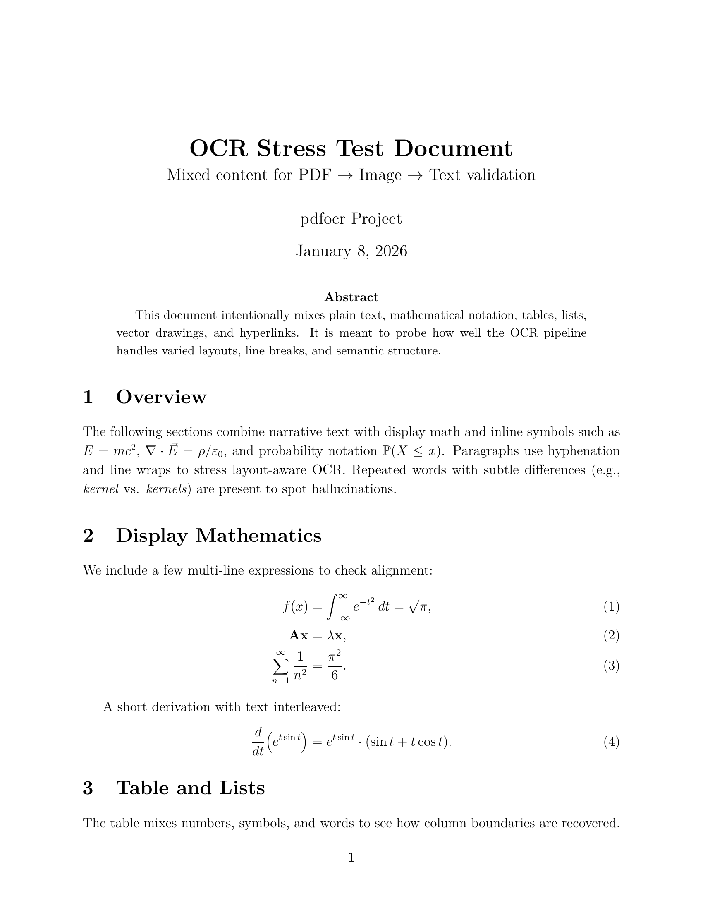
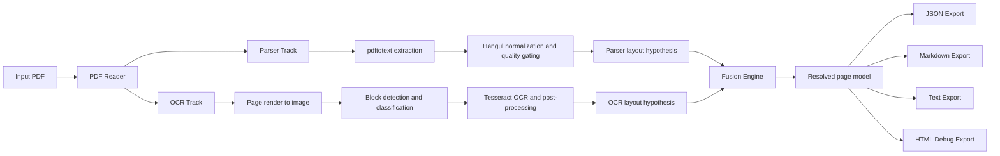

# DocStruct

DocStruct is a PDF document structure recovery tool that combines:

- parser-based extraction from PDF internals
- OCR-based extraction from rendered page images
- fusion logic to resolve conflicts and produce final structured output

The project focuses on practical mixed-content documents (text, tables, figures, equations) and multilingual OCR workflows.

Korean documentation is available at [README.ko.md](./docs/README.ko.md).

## Execution Snapshot (PDF -> TXT)

Command used:

```bash
./target/debug/docstruct convert tests/fixtures/test_document.pdf -o output_en --debug
```

<table>
<tr>
<th align="left">Input PDF</th>
<th align="left">Output TXT (excerpt)</th>
</tr>
<tr>
<td valign="top" width="52%">
<p><a href="./tests/fixtures/test_document.pdf"><code>tests/fixtures/test_document.pdf</code></a></p>
<p>Rendered preview (page 1):</p>

</td>
<td valign="top" width="48%">
<pre><code>=== Page 1 ===

OCR Stress Test Document
Mixed content for PDF -> Image -> Text validation
Abstract
This document intentionally mixes plain text, mathematical notation,
tables, lists, vector drawings, and hyperlinks.

1 Overview
The following sections combine narrative text with display math
and inline symbols such as E = mc^2 ...

2 Display Mathematics
f(x) = integral e^(-t^2) dt = sqrt(pi)
A x = lambda x
sum(1/n^2) = pi^2/6

3 Table and Lists
Feature | Value | Uncertainty | Note
Temperature | 21.4 | +/- 0.3 | baseline
Pressure | 101.2 | +/- 0.5 | nominal
</code></pre>
</td>
</tr>
</table>

## Core Capabilities

- Dual-track analysis: `Parser Track` + `OCR Track`
- Block classification: text, table, figure, math
- Fusion with confidence/provenance metadata (`parser`, `ocr`, `fused`)
- Korean support (parser-side Hangul normalization and OCR cross-check workflow)
- Multiple output formats:
  - `document.json`
  - `document.md`
  - `document.txt`
  - per-page markdown/text
  - HTML debug viewer

## Pipeline



## Setup

### Requirements

- Rust toolchain
- Python 3.12+
- `poppler-utils` (`pdftotext`, `pdftoppm`, `pdfinfo`)
- `tesseract` (with required language data)

### Option 1: Nix Flakes (recommended)

```bash
cd /path/to/DocStruct
nix develop
cargo build
```

### Option 2: Legacy nix-shell

```bash
cd /path/to/DocStruct
nix-shell
cargo build
```

### Option 3: direnv

`.envrc` already contains `use flake`.

```bash
cd /path/to/DocStruct
direnv allow
cargo build
```

### Optional: pix2tex for math LaTeX OCR

```bash
pip install --user 'pix2tex[gui]>=0.1.2'
```

## Usage

### Convert one PDF

```bash
./target/debug/docstruct convert input.pdf -o output_dir --debug
```

### Batch convert

```bash
./target/debug/docstruct batch file1.pdf file2.pdf -o output_dir --debug
```

### Show PDF info

```bash
./target/debug/docstruct info input.pdf
```

### Useful flags

- `--dpi <int>`: rendering DPI for OCR track (default: 200)
- `--debug`: write debug assets (rendered pages + HTML overlays)
- `--quiet`: reduced console logging

## Output Layout

```text
output_dir/
├── document.json
├── document.md
├── document.txt
├── page_001.md
├── page_001.txt
├── figures/
│   └── page_NNN_TYPE__NN.png
└── debug/
    ├── page_001.html
    └── page_001-1.png
```

## Data Model (high-level)

- `DocumentFinal`
  - `pages[]`
    - `PageFinal`
      - `blocks[]`
        - `TextBlock | TableBlock | FigureBlock | MathBlock`
      - `class`: `digital | scanned | hybrid`
      - `debug` (optional)

Each block includes `bbox`, `confidence`, and `source` provenance.

## Development Notes

### Common commands

```bash
cargo build
cargo test
cargo test parser::hangul
```

### Korean extraction behavior

The parser track includes Hangul normalization and quality gating to suppress severely degraded jamo output. Fusion and export layers also include filtering to reduce duplicated/noisy OCR text blocks when parser output is clearly dominant.

## Project Structure

```text
src/
  core/      # geometry, models, confidence
  parser/    # parser track and text extraction
  ocr/       # OCR track and bridge integration
  fusion/    # alignment, comparison, conflict resolution
  export/    # json/markdown/text/html exporters
ocr/bridge/  # Python OCR bridge
tests/       # fixtures and tests
docs/        # notes and plans
```

## License

MIT
