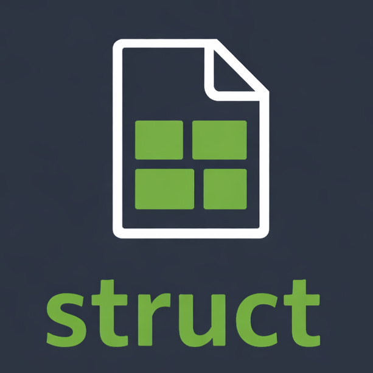
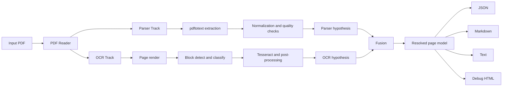

<p align="left">
  
</p>

# DocStruct

DocStruct is a PDF document structure recovery tool that combines parser extraction, OCR extraction, and a fusion layer to produce structured outputs.

- Parser track: extract text/layout from PDF internals
- OCR track: render pages and run block/text recognition
- Fusion track: align/resolve parser and OCR outputs with confidence metadata

Korean documentation: [docs/README.ko.md](./docs/README.ko.md)

## Snapshot

Command:

```bash
./target/debug/docstruct convert tests/fixtures/test_document.pdf -o output_en --debug
```

<table>
  <tr>
    <th width="33%">PDF Page 1</th>
    <th width="33%">PDF Page 2</th>
    <th width="33%">PDF Page 3</th>
  </tr>
  <tr>
    <td></td>
    <td></td>
    <td></td>
  </tr>
</table>

### Full Extracted Text (`document.txt`)

<details>
<summary>Show Full Text</summary>

```text
=== Page 1 ===

OCR Stress Test Document
Mixed content for PDF → Image → Text validation

pdfocr Project
January 8, 2026

Abstract
This document intentionally mixes plain text, mathematical notation, tables, lists,
vector drawings, and hyperlinks. It is meant to probe how well the OCR pipeline
handles varied layouts, line breaks, and semantic structure.

1     Overview
The following sections combine narrative text with display math and inline symbols such as
E = mc2 , ∇ · E⃗ = ρ/ε0 , and probability notation P(X ≤ x). Paragraphs use hyphenation
and line wraps to stress layout-aware OCR. Repeated words with subtle differences (e.g.,
kernel vs. kernels) are present to spot hallucinations.

2     Display Mathematics
We include a few multi-line expressions to check alignment:
Z ∞
2        √
f (x) =          e−t dt =     π,                           (1)
−∞

Ax = λx,                                                 (2)
∞
1    π    2
= .                                                  (3)
X

n=1 n
2  6

A short derivation with text interleaved:
d  t sin t 
e          = et sin t · (sin t + t cos t).                    (4)
dt

3     Table and Lists
The table mixes numbers, symbols, and words to see how column boundaries are recovered.

1


=== Page 2 ===

PDF OCR Stress Test                                                                          2

Feature                   Value   Uncertainty            Note
Temperature (◦ C)         21.4         ±0.3              baseline
Pressure (kPa)            101.2        ±0.5             nominal
Accuracy (%)              98.7         ±0.1          high-confidence
Latency (ms)               42          ±5           measured on edge

Table 1: Structured data with mixed units.

Nested lists follow:

• Top-level bullet with a hyperlink: https://example.com/data.

• Another bullet with emphasized text and a footnote.1

• Enumerated sub-tasks:

1. Capture inline math such as α, β, γ.
2. Handle words split across lines (hyphen- ation).
3. Keep indentation hints intact.

4         Vector Figure
The figure below is drawn with TikZ to avoid external images while still giving curves, labels,
and color.
y

peak
≈ π/2           oscillation

x
origin

Figure 1: Sine-like curve with annotations and grid.

1
Footnotes are included to see if ordering is preserved.


=== Page 3 ===

PDF OCR Stress Test                                                                    3

5    Paragraph Stress Test
Continuous prose with mixed punctuation: “Edge-aware OCR systems must balance recall
and precision; however, noise—especially from compressed scans—can create artifacts.” The
quick brown fox jumps over the lazy dog. A second paragraph repeats with minor edits to
detect hallucination: the quick brown fox jumps over the lazy dog, but this time the fox
pauses at line breaks to test robustness.

6    Code Fragment
Verbatim text can challenge OCR because of monospaced glyphs:

for (int i = 0; i < 5; ++i) {
double w = exp(-0.5 * pow(i - 2.0, 2));
printf("w[%d] = %.3f\n", i, w);
}

7    Conclusion
This concludes the synthetic PDF. Inspect the extracted text for dropped symbols, merged
lines, and mis-ordered sections. Compare the OCR output with the known ground truth
here to quantify accuracy.

```

</details>

## Features

- Dual-track analysis (`parser` + `ocr`)
- Text/table/figure/math block modeling
- Provenance and confidence fields in final output
- Korean-focused normalization and OCR noise filtering
- Output targets:
  - `document.json`
  - `document.md`
  - `document.txt`
  - page-level markdown/text
  - debug HTML overlays

## Pipeline



Detailed design: [docs/ARCHITECTURE.md](./docs/ARCHITECTURE.md)

## Setup

Requirements:

- Rust toolchain
- Python 3.12+
- `poppler-utils` (`pdftotext`, `pdftoppm`, `pdfinfo`)
- `tesseract` with required language data

Nix Flakes:

```bash
cd /path/to/DocStruct
nix develop
cargo build
```

Legacy nix-shell:

```bash
cd /path/to/DocStruct
nix-shell
cargo build
```

Optional math OCR (pix2tex):

```bash
pip install --user 'pix2tex[gui]>=0.1.2'
```

## Usage

Convert one PDF:

```bash
./target/debug/docstruct convert input.pdf -o output_dir --debug
```

Batch convert:

```bash
./target/debug/docstruct batch file1.pdf file2.pdf -o output_dir --debug
```

Inspect PDF info:

```bash
./target/debug/docstruct info input.pdf
```

Useful flags:

- `--dpi <int>`: render DPI for OCR (default: 200)
- `--debug`: write debug assets
- `--quiet`: reduce console logs

## Output Layout

```text
output_dir/
├── document.json
├── document.md
├── document.txt
├── page_001.md
├── page_001.txt
├── figures/
│   └── page_NNN_TYPE__NN.png
└── debug/
    ├── page_001.html
    └── page_001-1.png
```

## Development

```bash
cargo build
cargo test
cargo test parser::hangul
```

Contributing guide: [CONTRIBUTING.md](./CONTRIBUTING.md)

## License

MIT
