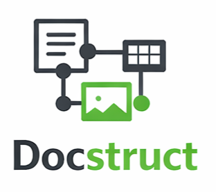
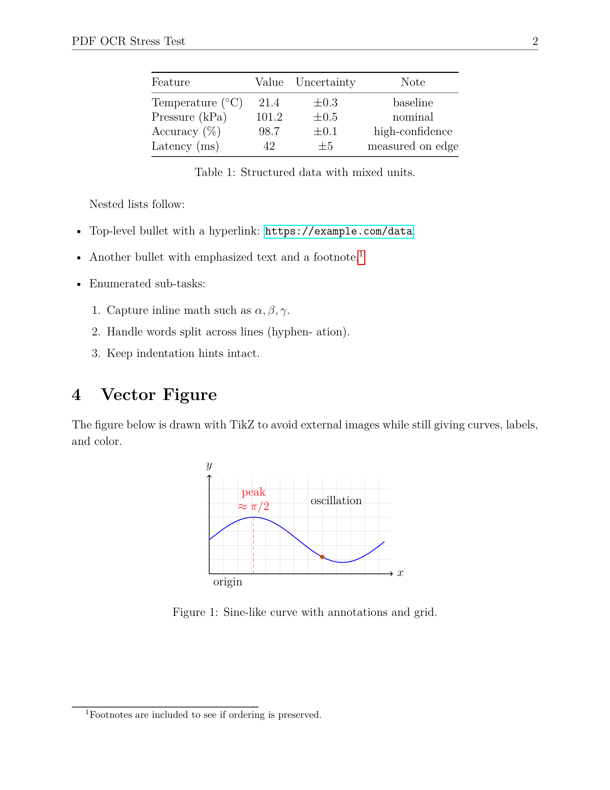
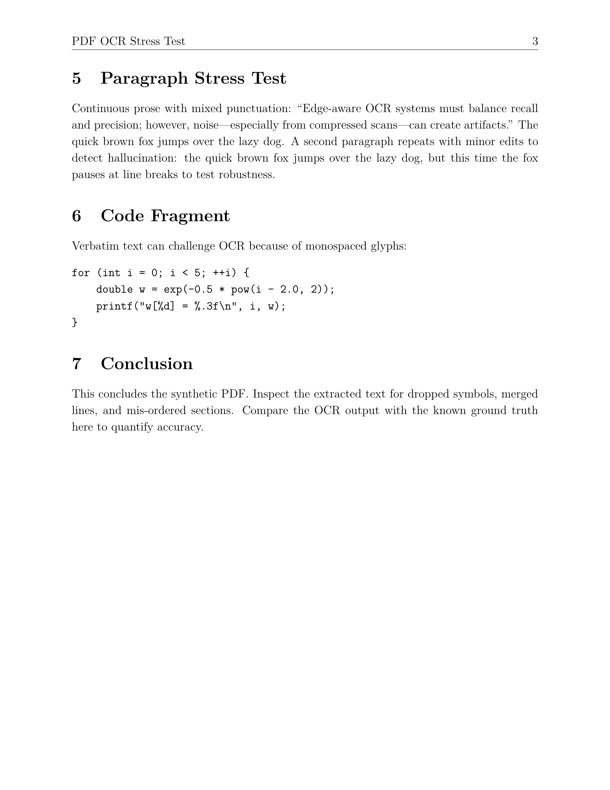
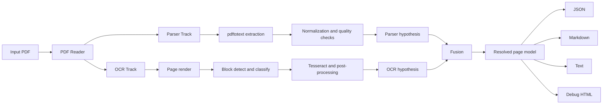

<p align="left">
  
</p>

# DocStruct


DocStruct is currently a PDF-first document structure recovery tool that combines parser extraction, OCR extraction, and a fusion layer to produce reliable structured outputs.

Current scope: PDF only.  
Planned next formats: DOCX and PPT/PPTX.

Korean documentation: [docs/README.ko.md](./docs/README.ko.md)

## Overview

| Track | Role |
| --- | --- |
| Parser | Extract text and layout from PDF internals |
| OCR | Render pages and detect blocks/text from images |
| Fusion | Align parser/OCR outputs with confidence and provenance |

## Snapshot

```bash
./target/debug/docstruct convert tests/fixtures/test_document.pdf -o output_en --debug
```

<table>
  <tr>
    <th width="33%">PDF Page 1</th>
    <th width="33%">PDF Page 2</th>
    <th width="33%">PDF Page 3</th>
  </tr>
  <tr>
    <td></td>
    <td></td>
    <td></td>
  </tr>
</table>

### Output Artifacts

- `document.json`
- `document.md`
- `document.txt`
- `page_XXX.md` / `page_XXX.txt`
- `figures/*.png`
- `debug/*.html`

## Pipeline



Detailed design: [docs/ARCHITECTURE.md](./docs/ARCHITECTURE.md)

## Setup

Requirements:

- Rust toolchain
- Python 3.12+
- `poppler-utils` (`pdftotext`, `pdftoppm`, `pdfinfo`)
- `tesseract` with required language data

Nix Flakes:

```bash
nix develop
cargo build
```

Legacy nix-shell:

```bash
nix-shell
cargo build
```

Optional math OCR (pix2tex):

```bash
pip install --user 'pix2tex[gui]>=0.1.2'
```

## Usage

| Command | Purpose |
| --- | --- |
| `./target/debug/docstruct convert input.pdf -o output_dir --debug` | Convert one PDF |
| `./target/debug/docstruct batch file1.pdf file2.pdf -o output_dir --debug` | Convert multiple PDFs |
| `./target/debug/docstruct info input.pdf` | Inspect PDF metadata |

Useful flags:

- `--dpi <int>`: render DPI for OCR (default: 200)
- `--debug`: write debug assets
- `--quiet`: reduce console logs

## Output Layout

```text
output_dir/
├── document.json
├── document.md
├── document.txt
├── page_001.md
├── page_001.txt
├── figures/
│   └── page_NNN_TYPE__NN.png
└── debug/
    ├── page_001.html
    └── page_001-1.png
```

## Development

```bash
cargo build
cargo test
cargo test parser::hangul
```

Contributing guide: [CONTRIBUTING.md](./CONTRIBUTING.md)
