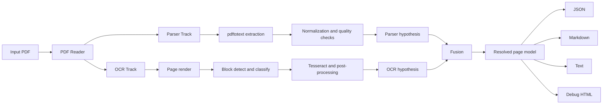

<p align="center">
  
</p>

# DocStruct

DocStruct is a PDF document structure recovery tool that combines parser extraction, OCR extraction, and a fusion layer to produce structured outputs.

- Parser track: extract text/layout from PDF internals
- OCR track: render pages and run block/text recognition
- Fusion track: align/resolve parser and OCR outputs with confidence metadata

Korean documentation: [docs/README.ko.md](./docs/README.ko.md)

## Snapshot

Command:

```bash
./target/debug/docstruct convert tests/fixtures/test_document.pdf -o output_en --debug
```

<table>
  <tr>
    <th>PDF Page 1</th>
    <th>PDF Page 2</th>
    <th>Extracted Text</th>
  </tr>
  <tr>
    <td></td>
    <td></td>
    <td>
      <pre><code>=== Page 1 ===
OCR Stress Test Document
Mixed content for PDF -> Image -> Text validation

Abstract
This document intentionally mixes plain text,
mathematical notation, tables, lists, vector drawings,
and hyperlinks.

=== Page 2 ===
Table and Lists
Feature | Value | Uncertainty | Note
Temperature | 21.4 | +/- 0.3 | baseline</code></pre>
    </td>
  </tr>
</table>

## Features

- Dual-track analysis (`parser` + `ocr`)
- Text/table/figure/math block modeling
- Provenance and confidence fields in final output
- Korean-focused normalization and OCR noise filtering
- Output targets:
  - `document.json`
  - `document.md`
  - `document.txt`
  - page-level markdown/text
  - debug HTML overlays

## Pipeline



Detailed design: [docs/ARCHITECTURE.md](./docs/ARCHITECTURE.md)

## Setup

Requirements:

- Rust toolchain
- Python 3.12+
- `poppler-utils` (`pdftotext`, `pdftoppm`, `pdfinfo`)
- `tesseract` with required language data

Nix Flakes:

```bash
cd /path/to/DocStruct
nix develop
cargo build
```

Legacy nix-shell:

```bash
cd /path/to/DocStruct
nix-shell
cargo build
```

Optional math OCR (pix2tex):

```bash
pip install --user 'pix2tex[gui]>=0.1.2'
```

## Usage

Convert one PDF:

```bash
./target/debug/docstruct convert input.pdf -o output_dir --debug
```

Batch convert:

```bash
./target/debug/docstruct batch file1.pdf file2.pdf -o output_dir --debug
```

Inspect PDF info:

```bash
./target/debug/docstruct info input.pdf
```

Useful flags:

- `--dpi <int>`: render DPI for OCR (default: 200)
- `--debug`: write debug assets
- `--quiet`: reduce console logs

## Output Layout

```text
output_dir/
├── document.json
├── document.md
├── document.txt
├── page_001.md
├── page_001.txt
├── figures/
│   └── page_NNN_TYPE__NN.png
└── debug/
    ├── page_001.html
    └── page_001-1.png
```

## Development

```bash
cargo build
cargo test
cargo test parser::hangul
```

Contributing guide: [CONTRIBUTING.md](./CONTRIBUTING.md)

## License

MIT
