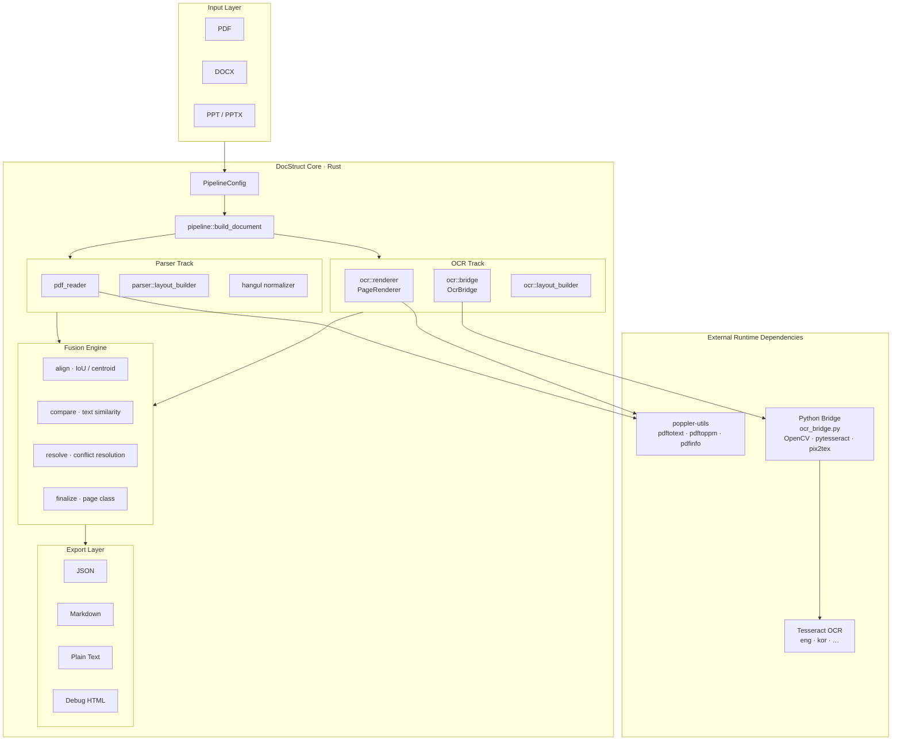
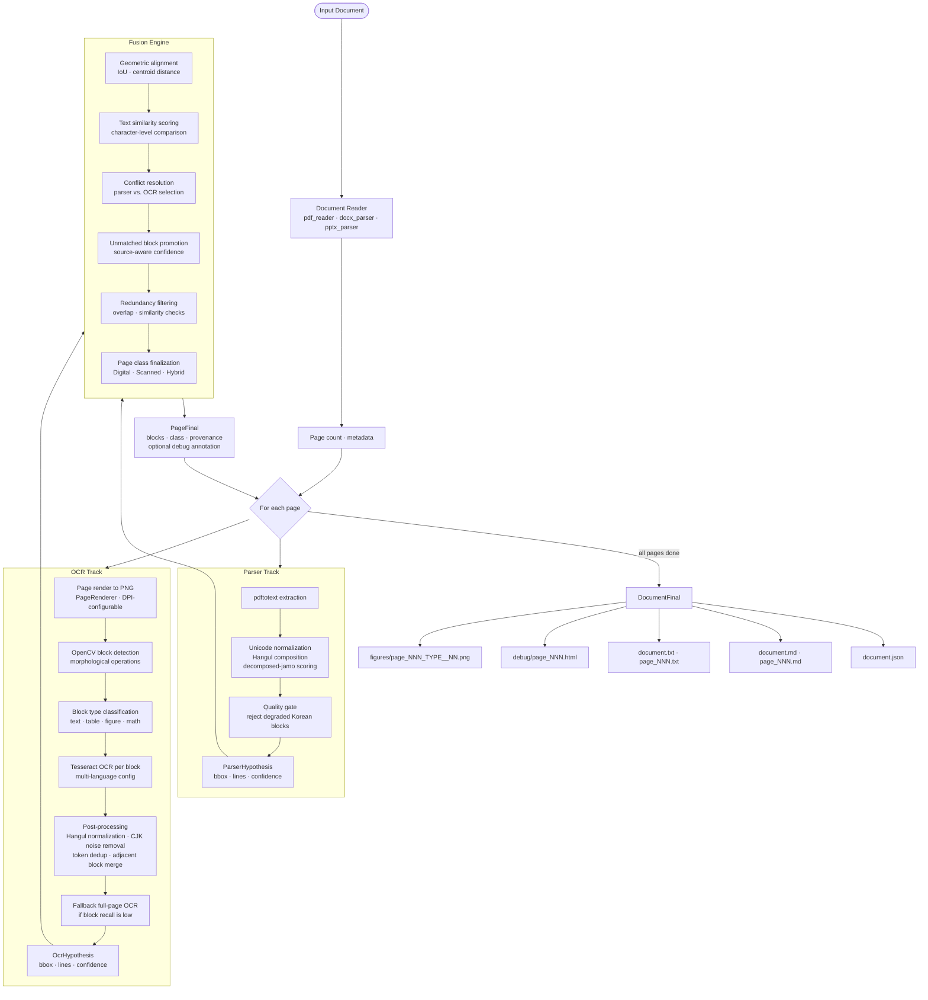
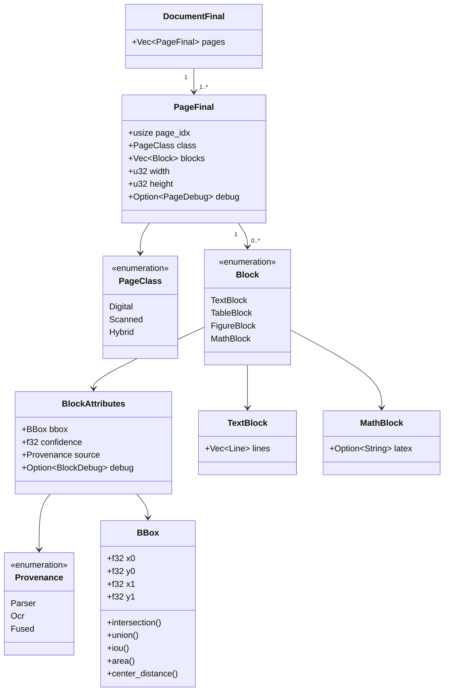
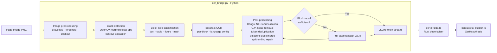
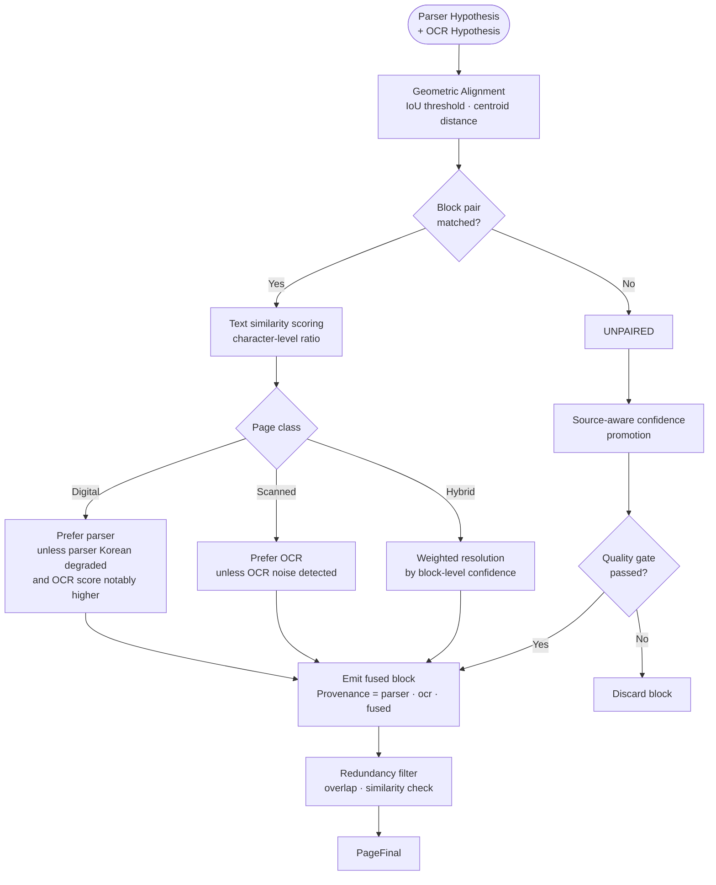
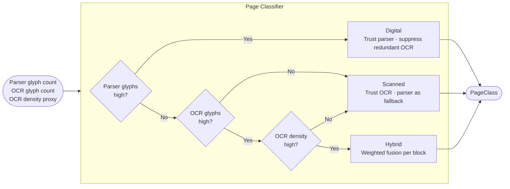
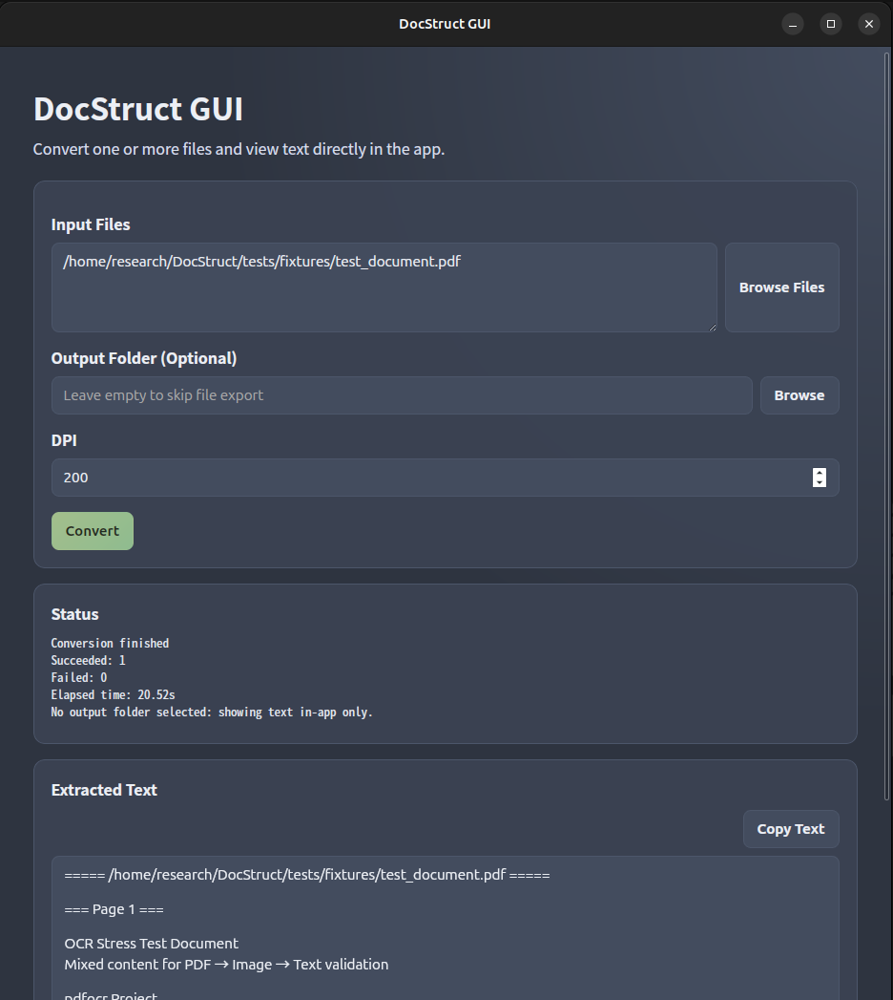

<p align="left">
  
</p>

# DocStruct

[](https://github.com/zeetee1235/DocStruct/actions/workflows/ci.yml)
[](https://github.com/zeetee1235/DocStruct/actions/workflows/docker-image.yml)
[](https://github.com/zeetee1235/DocStruct/commits/main)
[](./LICENSE)

> **DocStruct** is a document structure recovery system that combines native PDF parsing with optical character recognition (OCR) through a dual-track fusion pipeline. It produces structured, provenance-annotated outputs from heterogeneous document formats including PDF, DOCX, PPT, and PPTX.

For documentation in Korean, refer to [docs/README.ko.md](./docs/README.ko.md).

---

## Table of Contents

1. [Abstract](#abstract)
2. [System Architecture](#system-architecture)
3. [Processing Pipeline](#processing-pipeline)
4. [Module Descriptions](#module-descriptions)
   - [Core Data Model](#41-core-data-model)
   - [Parser Track](#42-parser-track)
   - [OCR Track](#43-ocr-track)
   - [Fusion Engine](#44-fusion-engine)
   - [Export Layer](#45-export-layer)
5. [Page Classification](#page-classification)
6. [Installation](#installation)
7. [Usage](#usage)
   - [Graphical User Interface](#71-graphical-user-interface)
   - [Command-Line Interface](#72-command-line-interface)
8. [Output Specification](#output-specification)
9. [Configuration Reference](#configuration-reference)
10. [Development and Testing](#development-and-testing)
11. [Known Limitations](#known-limitations)
12. [Release Policy](#release-policy)
13. [Contributing](#contributing)

---

## Abstract

Document digitization workflows frequently encounter a fundamental tension: native PDF text extraction preserves layout fidelity for programmatically generated files but fails on scanned or image-rendered content, whereas OCR provides broad coverage at the cost of increased error rates and hallucination risk. DocStruct addresses this problem through a **dual-track, evidence-fusion architecture** in which a parser track and an OCR track operate independently per page, and a dedicated fusion engine resolves conflicts by geometric alignment, textual similarity scoring, and source-aware confidence heuristics.

The system is implemented in Rust with a Python OCR bridge, supports Korean-specific normalization (Hangul composition, decomposed jamo degradation scoring), and exports results in JSON, Markdown, plain text, and annotated debug HTML. Each output block carries a provenance label (`parser`, `ocr`, or `fused`) enabling downstream auditability.

---

## System Architecture

**Figure 1** provides a high-level component view of DocStruct, illustrating the three principal subsystems and their external dependencies.


```mermaid
graph TB
    subgraph Input["Input Layer"]
        I1[PDF]
        I2[DOCX]
        I3[PPT / PPTX]
    end

    subgraph Core["DocStruct Core  ·  Rust"]
        direction TB
        CFG[PipelineConfig]
        PL[pipeline::build_document]

        subgraph Parser["Parser Track"]
            PR[pdf_reader]
            PL2[parser::layout_builder]
            HG[hangul normalizer]
        end

        subgraph OCR["OCR Track"]
            RND[ocr::renderer\nPageRenderer]
            BRG[ocr::bridge\nOcrBridge]
            OLB[ocr::layout_builder]
        end

        subgraph Fusion["Fusion Engine"]
            ALN[align · IoU / centroid]
            CMP[compare · text similarity]
            RSV[resolve · conflict resolution]
            FNL[finalize · page class]
        end

        subgraph Export["Export Layer"]
            EJ[JSON]
            EM[Markdown]
            ET[Plain Text]
            EH[Debug HTML]
        end
    end

    subgraph Ext["External Runtime Dependencies"]
        PP[poppler-utils\npdftotext · pdftoppm · pdfinfo]
        TS[Tesseract OCR\neng · kor · …]
        PY[Python Bridge\nocr_bridge.py\nOpenCV · pytesseract · pix2tex]
    end

    Input --> CFG
    CFG --> PL
    PL --> Parser
    PL --> OCR
    Parser --> Fusion
    OCR --> Fusion
    Fusion --> Export

    PR --> PP
    RND --> PP
    BRG --> PY
    PY --> TS
```

*Figure 1 — Component architecture of DocStruct. Arrows indicate data flow; dashed boundaries group logical subsystems.*

---

## Processing Pipeline

**Figure 2** details the per-page processing sequence from raw input to structured, fused output.


```mermaid
flowchart TD
    A([Input Document]) --> B[Document Reader\npdf_reader · docx_parser · pptx_parser]
    B --> META[Page count · metadata]
    META --> LOOP{For each page}

    LOOP --> PT[Parser Track]
    LOOP --> OT[OCR Track]

    subgraph PT [" Parser Track "]
        direction TB
        P1[pdftotext extraction]
        P2[Unicode normalization\nHangul composition\ndecomposed-jamo scoring]
        P3[Quality gate\nreject degraded Korean blocks]
        P4[ParserHypothesis\nbbox · lines · confidence]
        P1 --> P2 --> P3 --> P4
    end

    subgraph OT [" OCR Track "]
        direction TB
        O1[Page render to PNG\nPageRenderer · DPI-configurable]
        O2[OpenCV block detection\nmorphological operations]
        O3[Block type classification\ntext · table · figure · math]
        O4[Tesseract OCR per block\nmulti-language config]
        O5[Post-processing\nHangul normalization · CJK noise removal\ntoken dedup · adjacent block merge]
        O6[Fallback full-page OCR\nif block recall is low]
        O7[OcrHypothesis\nbbox · lines · confidence]
        O1 --> O2 --> O3 --> O4 --> O5 --> O6 --> O7
    end

    P4 --> FUS[Fusion Engine]
    O7 --> FUS

    subgraph FUS [" Fusion Engine "]
        direction TB
        F1[Geometric alignment\nIoU · centroid distance]
        F2[Text similarity scoring\ncharacter-level comparison]
        F3[Conflict resolution\nparser vs. OCR selection]
        F4[Unmatched block promotion\nsource-aware confidence]
        F5[Redundancy filtering\noverlap · similarity checks]
        F6[Page class finalization\nDigital · Scanned · Hybrid]
        F1 --> F2 --> F3 --> F4 --> F5 --> F6
    end

    FUS --> PAGE[PageFinal\nblocks · class · provenance\noptional debug annotation]
    PAGE --> LOOP

    LOOP -->|all pages done| DOC[DocumentFinal]

    DOC --> EJ[document.json]
    DOC --> EM[document.md · page_NNN.md]
    DOC --> ET[document.txt · page_NNN.txt]
    DOC --> EH[debug/page_NNN.html]
    DOC --> EF[figures/page_NNN_TYPE__NN.png]
```

*Figure 2 — Per-page processing pipeline. Both tracks execute independently; the fusion engine resolves conflicts and assembles the final page model.*

---

## Module Descriptions

### 4.1 Core Data Model

The `src/core` module defines the canonical data types shared across all pipeline stages.


```mermaid
classDiagram
    class DocumentFinal {
        +Vec~PageFinal~ pages
    }
    class PageFinal {
        +usize page_idx
        +PageClass class
        +Vec~Block~ blocks
        +u32 width
        +u32 height
        +Option~PageDebug~ debug
    }
    class PageClass {
        <<enumeration>>
        Digital
        Scanned
        Hybrid
    }
    class Block {
        <<enumeration>>
        TextBlock
        TableBlock
        FigureBlock
        MathBlock
    }
    class BlockAttributes {
        +BBox bbox
        +f32 confidence
        +Provenance source
        +Option~BlockDebug~ debug
    }
    class TextBlock {
        +Vec~Line~ lines
    }
    class MathBlock {
        +Option~String~ latex
    }
    class Provenance {
        <<enumeration>>
        Parser
        Ocr
        Fused
    }
    class BBox {
        +f32 x0
        +f32 y0
        +f32 x1
        +f32 y1
        +intersection()
        +union()
        +iou()
        +area()
        +center_distance()
    }

    DocumentFinal "1" --> "1..*" PageFinal
    PageFinal --> PageClass
    PageFinal "1" --> "0..*" Block
    Block --> BlockAttributes
    Block --> TextBlock
    Block --> MathBlock
    BlockAttributes --> Provenance
    BlockAttributes --> BBox
```

*Figure 3 — Core domain model. Every `Block` carries a `Provenance` label and a `BBox` enabling geometric operations throughout the pipeline.*

**Key design decisions:**

- All types are `serde`-serializable, enabling zero-cost JSON export without a separate translation layer.
- `Provenance` is preserved on every block, supporting full auditability of the fusion decision for each content region.
- `PageClass` (determined by the fusion engine) governs source preference: `Digital` pages trust the parser track; `Scanned` pages rely primarily on OCR; `Hybrid` pages apply weighted resolution.

---

### 4.2 Parser Track

| Component | Responsibility |
|---|---|
| `pdf_reader.rs` | Opens PDF, reads page count and metadata via `pdfinfo` |
| `text_extractor` | Invokes `pdftotext` and normalizes the raw text stream |
| `hangul.rs` | Decomposes and recomposes Hangul syllables; scores jamo degradation |
| `layout_builder.rs` | Constructs `ParserHypothesis` with bounding-box estimates |
| `docx_parser.rs` | Extracts structured content from DOCX via ZIP/XML traversal |
| `pptx_parser.rs` | Extracts slide text and shape geometry from PPTX |

**Failure profile:** The parser track may omit rendered-only text or figures, and may emit decomposed or noisy Unicode depending on the PDF's internal encoding. Quality gates suppress severely degraded Korean outputs before they reach the fusion stage.

---

### 4.3 OCR Track

The OCR track comprises a Rust orchestrator and a Python bridge process.

**Figure 4** illustrates the Python bridge's internal processing stages.


```mermaid
flowchart LR
    IMG[Page Image PNG] --> PRE

    subgraph PY ["ocr_bridge.py  ·  Python"]
        PRE[Image preprocessing\ngrayscale · threshold · deskew]
        BLK[Block detection\nOpenCV morphological ops\ncontour extraction]
        CLS[Block type classification\ntext · table · figure · math]
        TSR[Tesseract OCR\nper-block · language config]
        PST[Post-processing\nHangul NFC normalization\nCJK noise removal\ntoken deduplication\nadjacent block merge\nsplit-ending repair]
        FBK{Block recall\nsufficient?}
        FPG[Full-page fallback OCR]

        PRE --> BLK --> CLS --> TSR --> PST --> FBK
        FBK -- No --> FPG --> PST
        FBK -- Yes --> OUT
        FPG --> OUT
    end

    OUT[JSON token stream] --> RB[ocr::bridge.rs\nRust deserializer]
    RB --> OLB[ocr::layout_builder.rs\nOcrHypothesis]
```

*Figure 4 — Internal stages of the Python OCR bridge. A block-recall check triggers full-page fallback OCR when segmentation produces insufficient coverage.*

**Optional math OCR:** When `pix2tex` is installed, `MathBlock` regions are routed through a dedicated LaTeX prediction model.

---

### 4.4 Fusion Engine

The fusion engine resolves conflicts between the two independent hypotheses and determines the final page model.

**Figure 5** shows the resolution logic for each matched block pair.


```mermaid
flowchart TD
    START([Parser Hypothesis\n+ OCR Hypothesis]) --> ALIGN

    ALIGN[Geometric Alignment\nIoU threshold · centroid distance]

    ALIGN --> MATCHED{Block pair\nmatched?}

    MATCHED -- Yes --> SIM[Text similarity scoring\ncharacter-level ratio]
    MATCHED -- No --> UNPAIRED

    SIM --> PC{Page class}

    PC -- Digital --> PRFTRUST[Prefer parser\nunless parser Korean degraded\nand OCR score notably higher]
    PC -- Scanned --> OCRTRUST[Prefer OCR\nunless OCR noise detected]
    PC -- Hybrid --> WRES[Weighted resolution\nby block-level confidence]

    PRFTRUST --> EMIT[Emit fused block\nProvenance = parser · ocr · fused]
    OCRTRUST --> EMIT
    WRES --> EMIT

    UNPAIRED --> CONF[Source-aware confidence\npromotion]
    CONF --> QGATE{Quality gate\npassed?}
    QGATE -- Yes --> EMIT
    QGATE -- No --> DROP[Discard block]

    EMIT --> REDUND[Redundancy filter\noverlap · similarity check]
    REDUND --> FINAL[PageFinal]
```

*Figure 5 — Fusion resolution logic. Every matched block pair undergoes page-class-aware source selection; unmatched blocks are promoted with source-aware confidence and filtered by quality gates.*

**Core heuristics:**

- **Parser trust for digital text:** Clean digital pages prefer the parser track, which preserves original Unicode fidelity.
- **OCR for coverage gaps:** Regions absent from the parser hypothesis (e.g., rendered text in images) are sourced from the OCR track.
- **Korean precision controls:** Strict OCR Korean suppression applies when the parser Korean hypothesis is reliable, trading recall for character-level precision.
- **Redundancy elimination:** OCR snippets that duplicate parser content by overlap and similarity are filtered to prevent repeated content in exports.

---

### 4.5 Export Layer

| Exporter | Output | Description |
|---|---|---|
| `json_export.rs` | `document.json` | Full structured document with provenance and confidence |
| `markdown_export.rs` | `document.md`, `page_NNN.md` | Human-readable Markdown, preserving heading hierarchy |
| `text_export.rs` | `document.txt`, `page_NNN.txt` | Plain-text concatenation for downstream NLP pipelines |
| `html_debug_export.rs` | `debug/page_NNN.html` | Per-block metadata overlay: type, provenance, confidence, similarity |

---

## Page Classification

Page classification determines the fusion strategy applied to each page.


```mermaid
flowchart LR
    IN([Parser glyph count\nOCR glyph count\nOCR density proxy]) --> CLS

    subgraph CLS [Page Classifier]
        direction TB
        C1{Parser glyphs\nhigh?}
        C2{OCR glyphs\nhigh?}
        C3{OCR density\nhigh?}

        C1 -- Yes --> DIG[Digital\nTrust parser · suppress redundant OCR]
        C1 -- No --> C2
        C2 -- No --> SCN[Scanned\nTrust OCR · parser as fallback]
        C2 -- Yes --> C3
        C3 -- Yes --> HYB[Hybrid\nWeighted fusion per block]
        C3 -- No --> SCN
    end

    DIG --> OUT([PageClass])
    SCN --> OUT
    HYB --> OUT
```

*Figure 6 — Page classification decision logic. The resulting `PageClass` (Digital / Scanned / Hybrid) governs fusion aggressiveness and source preference in the fusion engine.*

---

## Installation

### Runtime Requirements

| Dependency | Purpose | Required |
|---|---|---|
| Rust toolchain (`cargo`) | Build DocStruct | Yes |
| Python 3.8+ | OCR bridge runtime | Yes |
| `tesseract` + language packs (`eng`, `kor`, …) | OCR engine | Yes |
| `poppler-utils` (`pdfinfo`, `pdftotext`, `pdftoppm`) | PDF parsing and rendering | Yes |
| WebKitGTK | GUI runtime (Linux) | GUI only |
| Wayland dev/runtime packages | GUI runtime (Linux/Wayland) | GUI only |

### Python Dependencies

```bash
pip install -r requirements.txt
```

### Optional: Mathematical OCR

```bash
pip install --user 'pix2tex[gui]>=0.1.2'
```

When installed, `MathBlock` regions are processed by the `pix2tex` LaTeX prediction model in addition to standard Tesseract OCR.

### Pre-built Binaries

Pre-compiled binaries for Linux, Windows, and macOS are available on the [Releases](https://github.com/zeetee1235/DocStruct/releases) page.

---

## Usage

### 7.1 Graphical User Interface



*Figure 7 — DocStruct desktop GUI (Tauri). File selection, DPI configuration, and inline result display are available in a single workflow.*

Launch the GUI with:

```bash
./run-gui
```

The `run-gui` script automatically:

1. Creates or reuses a Python virtual environment (`.venv`)
2. Installs dependencies from `requirements.txt`
3. Launches the Tauri desktop application

**Workflow:**

1. Select one or more input files (PDF, DOCX, PPT, PPTX).
2. Optionally specify an output directory.
3. Adjust the DPI setting (default: `200`; higher values improve OCR accuracy at the cost of processing time).
4. Click **Convert**.

If no output directory is specified, extracted text is displayed inline within the application. The **Copy Text** button copies results to the system clipboard.

---

### 7.2 Command-Line Interface

#### Build

```bash
cargo build --release
```

#### Convert a Single File

```bash
./target/release/docstruct convert input.pdf -o output_dir --debug
```

#### Convert Multiple Files (Batch Mode)

```bash
./target/release/docstruct batch file1.pdf file2.pdf -o output_dir --debug
```

#### Inspect Document Metadata

```bash
./target/release/docstruct info input.pdf
```

#### CLI Options

| Flag | Type | Default | Description |
|---|---|---|---|
| `--dpi <int>` | `u32` | `200` | Page rendering DPI for OCR |
| `--debug` | flag | off | Emit debug artifacts (HTML overlays, intermediate PNGs) |
| `--quiet` | flag | off | Suppress verbose console output |

---

## Output Specification

```text
output_dir/
├── document.json          # Full structured document (all pages, all blocks, provenance)
├── document.md            # Merged Markdown export
├── document.txt           # Merged plain-text export
├── page_001.md            # Per-page Markdown
├── page_001.txt           # Per-page plain text
├── figures/
│   └── page_NNN_TYPE__NN.png   # Extracted figure/table regions
└── debug/                 # Generated when --debug is passed
    ├── page_001.html      # Annotated block overlay (type · provenance · confidence)
    └── page_001-1.png     # Rendered page image used by OCR
```

**JSON schema excerpt:**

```json
{
  "pages": [
    {
      "page_idx": 0,
      "class": "digital",
      "blocks": [
        {
          "type": "TextBlock",
          "bbox": { "x0": 72.0, "y0": 90.0, "x1": 540.0, "y1": 110.0 },
          "lines": [ { "text": "Introduction", "confidence": 0.97 } ],
          "confidence": 0.97,
          "source": "parser"
        }
      ]
    }
  ]
}
```

---

## Configuration Reference

`PipelineConfig` (Rust struct, `src/pipeline.rs`):

| Field | Type | Description |
|---|---|---|
| `input` | `PathBuf` | Path to the input document |
| `output` | `PathBuf` | Path to the output directory |
| `dpi` | `u32` | Rendering DPI passed to `pdftoppm` and the OCR bridge |

Environment overrides for the OCR bridge path are respected at runtime (see `src/ocr/bridge.rs`).

---

## Development and Testing

```bash
# Build (debug profile)
cargo build

# Run all tests
cargo test

# Run a specific test module
cargo test parser::hangul

# Smoke test against a sample fixture
./scripts/smoke.sh

# Verify output structure
./scripts/verify.sh

# Evaluate accuracy against reference fixtures
python scripts/eval_accuracy.py
```

**Test coverage areas:**

| Area | Status |
|---|---|
| Geometry primitives (`BBox` operations) | Covered |
| Text similarity scoring | Covered |
| Hangul normalization behaviors | Covered |
| Fusion filtering / selection cases | Covered |
| Parser + OCR integration smoke tests | Covered |
| Per-language precision/recall regression | Recommended |
| Page-class regression (`Digital/Scanned/Hybrid`) | Recommended |
| OCR bridge post-processing snapshot tests | Recommended |

For architectural details, refer to [docs/ARCHITECTURE.md](./docs/ARCHITECTURE.md).

---

## Known Limitations

| Area | Limitation |
|---|---|
| Mathematical content | Formula-dense regions can produce OCR symbol hallucinations even with `pix2tex` |
| Coverage metric | Block coverage is estimated heuristically; no semantic segmentation is applied |
| Parser layout | Some PDFs with complex multi-column or custom encoding collapse layout fidelity in the parser track |
| OCR edge cases | Low-confidence short fragments may survive quality gates on certain scanned pages |
| Korean OCR recall | Strict Korean suppression improves precision but may reduce recall in OCR-only regions |

---

## Release Policy

Releases are triggered by Git tags matching `v*`, which invoke automated GitHub Actions workflows.

| Platform | Artifact | Workflow |
|---|---|---|
| Linux | CLI binary, `.deb`, `.rpm` | [`release.yml`](./.github/workflows/release.yml) |
| Windows / macOS | Tauri GUI installer | [`gui-release.yml`](./.github/workflows/gui-release.yml) |
| Linux | GUI `.deb`, `.rpm` | [`gui-release.yml`](./.github/workflows/gui-release.yml) |
| All | Docker image | [`docker-image.yml`](./.github/workflows/docker-image.yml) |

#### Building GUI Installers Locally

```bash
./scripts/build-gui-app.sh
# Output: gui/src-tauri/target/release/bundle/
```

On Linux, `.deb` and `.rpm` packages are generated by default.

---

## Contributing

Contributions are welcome. Please refer to [CONTRIBUTING.md](./CONTRIBUTING.md) for coding standards, branch strategy, and pull request guidelines.
