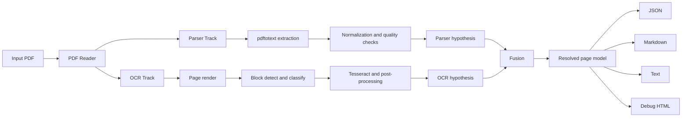

<p align="left">
  
</p>

# DocStruct


DocStruct recovers document structure using a Parser + OCR + Fusion pipeline and exports structured outputs.

Supported input formats: **PDF, DOCX, PPT, PPTX**

Korean documentation: [docs/README.ko.md](./docs/README.ko.md)

## GUI Snapshot


## Quick Start (GUI)

Run:

```bash
./run-gui
```

What `run-gui` does:
- creates/uses `.venv`
- installs Python packages from `requirements.txt`
- launches the Tauri desktop app

In the app:
1. Select one or more input files
2. Optionally select an output directory
3. Set DPI (default `200`)
4. Click **Convert**

If output directory is empty, conversion still runs and extracted text is shown in-app.
Use **Copy Text** to copy results to clipboard.

## Installation Requirements

Required runtime tools:
- Rust toolchain (`cargo`)
- Python 3.8+
- `tesseract` (with language packs such as `eng`, `kor`)
- `poppler-utils` (`pdfinfo`, `pdftotext`, `pdftoppm`)

Linux GUI build/runtime notes:
- WebKitGTK packages
- Wayland dev/runtime packages (`wayland-client.pc` provider)

Optional (math OCR):

```bash
pip install --user 'pix2tex[gui]>=0.1.2'
```

## CLI Usage (Linux-focused)

Build:

```bash
cargo build --release
```

Convert one file:

```bash
./target/release/docstruct convert input.pdf -o output_dir --debug
```

Convert multiple files:

```bash
./target/release/docstruct batch file1.pdf file2.pdf -o output_dir --debug
```

Inspect file info:

```bash
./target/release/docstruct info input.pdf
```

Useful options:
- `--dpi <int>`: OCR rendering DPI (default `200`)
- `--debug`: write debug artifacts
- `--quiet`: reduce console logs

## Release Policy

Tag push `v*` publishes assets to GitHub Releases.

- **Windows/macOS**: Desktop GUI installers (Tauri)
- **Linux**:
  - CLI binaries/packages
  - GUI packages (`.deb`, `.rpm`)

Workflows:
- [`.github/workflows/release.yml`](./.github/workflows/release.yml): Linux CLI release
- [`.github/workflows/gui-release.yml`](./.github/workflows/gui-release.yml): GUI release (Windows/macOS/Linux GUI)

## Build GUI Installers Locally

```bash
./scripts/build-gui-app.sh
```

Outputs are generated under:
- `gui/src-tauri/target/release/bundle/`

On Linux, the script builds `deb` and `rpm` by default.


## Pipeline


```mermaid
flowchart LR
    A[Input PDF] --> B[PDF Reader]

    B --> C[Parser Track]
    B --> D[OCR Track]

    C --> C1[pdftotext extraction]
    C1 --> C2[Normalization and quality checks]
    C2 --> C3[Parser hypothesis]

    D --> D1[Page render]
    D1 --> D2[Block detect and classify]
    D2 --> D3[Tesseract and post-processing]
    D3 --> D4[OCR hypothesis]

    C3 --> E[Fusion]
    D4 --> E

    E --> F[Resolved page model]
    F --> G1[JSON]
    F --> G2[Markdown]
    F --> G3[Text]
    F --> G4[Debug HTML]
```


## Output Layout

```text
output_dir/
├── document.json
├── document.md
├── document.txt
├── page_001.md
├── page_001.txt
├── figures/
│   └── page_NNN_TYPE__NN.png
└── debug/
    ├── page_001.html
    └── page_001-1.png
```

## Development

```bash
cargo build
cargo test
cargo test parser::hangul
```

Architecture: [docs/ARCHITECTURE.md](./docs/ARCHITECTURE.md)  
Contributing: [CONTRIBUTING.md](./CONTRIBUTING.md)
