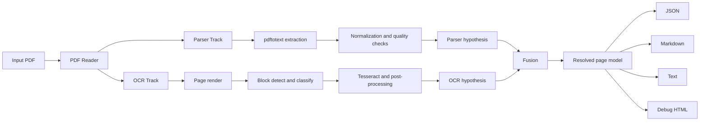

<p align="left">
  
</p>

# DocStruct

DocStruct is a tool designed to recover document structure through a pipeline consisting of parsing, optical character recognition (OCR), and fusion processes. The tool supports structured output formats for various document types.

Supported input formats include: **PDF, DOCX, PPT, PPTX**

For documentation in Korean, refer to [docs/README.ko.md](./docs/README.ko.md).

## Graphical User Interface (GUI)

A snapshot of the GUI is provided below:


## Quick Start (GUI)

To launch the GUI, execute the following command:

```bash
./run-gui
```

The `run-gui` script performs the following tasks:
- Creates or utilizes a virtual environment (`.venv`)
- Installs the required Python packages from `requirements.txt`
- Launches the Tauri desktop application

Within the application:
1. Select one or more input files.
2. Optionally specify an output directory.
3. Adjust the DPI setting (default: `200`).
4. Click the **Convert** button.

If no output directory is specified, the conversion process will still execute, and the extracted text will be displayed within the application. The **Copy Text** feature allows users to copy the results to the clipboard.

## Installation Requirements

The following runtime tools are required:
- Rust toolchain (`cargo`)
- Python 3.8 or later
- `tesseract` (including language packs such as `eng` and `kor`)
- `poppler-utils` (e.g., `pdfinfo`, `pdftotext`, `pdftoppm`)

For Linux GUI builds and runtime:
- WebKitGTK packages
- Wayland development/runtime packages (e.g., `wayland-client.pc` provider)

Optional dependency for mathematical OCR:

```bash
pip install --user 'pix2tex[gui]>=0.1.2'
```

## Download and Use

The latest binary files for various platforms can be downloaded from the [Releases](https://github.com/zeetee1235/DocStruct/releases) section. After downloading the appropriate file, extract its contents and follow the instructions provided in the accompanying documentation.

## Command-Line Interface (CLI)

### Build

```bash
cargo build --release
```

### Convert a Single File

```bash
./target/release/docstruct convert input.pdf -o output_dir --debug
```

### Convert Multiple Files

```bash
./target/release/docstruct batch file1.pdf file2.pdf -o output_dir --debug
```

### Inspect File Information

```bash
./target/release/docstruct info input.pdf
```

### Additional Options

- `--dpi <int>`: Specifies the OCR rendering DPI (default: `200`).
- `--debug`: Enables the generation of debug artifacts.
- `--quiet`: Reduces the verbosity of console logs.

## Release Policy

Releases are managed through Git tags prefixed with `v*`, which trigger workflows to publish assets to GitHub Releases.

- **Windows/macOS**: Desktop GUI installers (Tauri)
- **Linux**:
  - Command-line interface binaries and packages
  - GUI packages (`.deb`, `.rpm`)

Relevant workflows:
- [`.github/workflows/release.yml`](./.github/workflows/release.yml): Linux CLI release
- [`.github/workflows/gui-release.yml`](./.github/workflows/gui-release.yml): GUI release (Windows/macOS/Linux GUI)

## Building GUI Installers Locally

To build GUI installers locally, execute the following script:

```bash
./scripts/build-gui-app.sh
```

The generated outputs are located under:
- `gui/src-tauri/target/release/bundle/`

On Linux, the script generates `.deb` and `.rpm` packages by default.

## Pipeline Overview


```mermaid
flowchart LR
    A[Input PDF] --> B[PDF Reader]

    B --> C[Parser Track]
    B --> D[OCR Track]

    C --> C1[pdftotext extraction]
    C1 --> C2[Normalization and quality checks]
    C2 --> C3[Parser hypothesis]

    D --> D1[Page render]
    D1 --> D2[Block detect and classify]
    D2 --> D3[Tesseract and post-processing]
    D3 --> D4[OCR hypothesis]

    C3 --> E[Fusion]
    D4 --> E

    E --> F[Resolved page model]
    F --> G1[JSON]
    F --> G2[Markdown]
    F --> G3[Text]
    F --> G4[Debug HTML]
```

## Output Layout

The output directory structure is as follows:

```text
output_dir/
├── document.json
├── document.md
├── document.txt
├── page_001.md
├── page_001.txt
├── figures/
│   └── page_NNN_TYPE__NN.png
└── debug/
    ├── page_001.html
    └── page_001-1.png
```

## Development

To build and test the project, use the following commands:

```bash
cargo build
cargo test
cargo test parser::hangul
```

For additional architectural details, refer to [docs/ARCHITECTURE.md](./docs/ARCHITECTURE.md). For contribution guidelines, see [CONTRIBUTING.md](./CONTRIBUTING.md).

