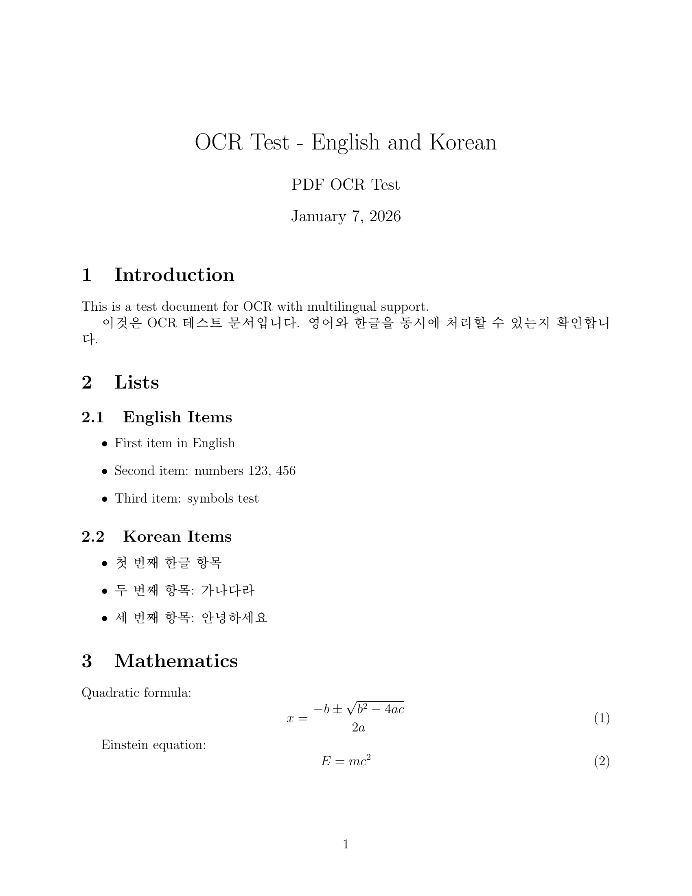
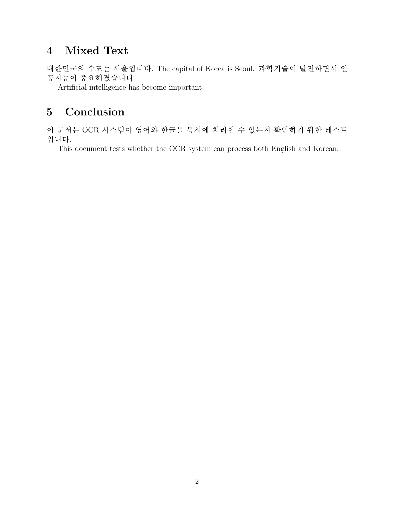
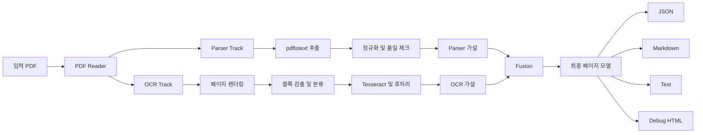

<p align="left">
  
</p>

# DocStruct (한국어 문서)

DocStruct는 PDF 문서 구조를 복원하는 도구입니다. Parser 추출, OCR 추출, Fusion 레이어를 결합해 구조화된 결과를 생성합니다.

- Parser 트랙: PDF 내부 텍스트/레이아웃 추출
- OCR 트랙: 페이지 렌더링 후 블록/텍스트 인식
- Fusion 트랙: parser/ocr 결과 정렬 및 해소

영문 문서: [../README.md](../README.md)

## Snapshot

명령어:

```bash
./target/debug/docstruct convert tests/fixtures/korean_test.pdf -o output_ko --debug
```

<table>
  <tr>
    <th width="50%">PDF Page 1</th>
    <th width="50%">PDF Page 2</th>
  </tr>
  <tr>
    <td></td>
    <td></td>
  </tr>
</table>

### 전체 추출 텍스트 (`document.txt`)

<details>
<summary>전체 텍스트 보기</summary>

```text
=== Page 1 ===

OCR Test - English and Korean
PDF OCR Test
January 7, 2026
1 Introduction
This is a test document for OCR with multilingual support.
이것은 OCR 테스트문서입니다. 영어와한글을동시에처리할수있는지확인합니다.
2 Lists
2.1 English Items
• First item in English
• Second item: numbers 123, 456
• Third item: symbols test
2.2 Korean Items
• 첫번째한글항목
• 두번째항목: 가나다라
• 세번째항목: 안녕하세요
3 Mathematics
Quadratic formula:
x =
−b ±
√
b2 − 4ac
2a
(1)
Einstein equation:
E = mc2
(2)
1

English and Korean Test

January 2026

Lists

English Items 2.1

Korean Items 2.2

—b+ V0? — 406

= mc?


=== Page 2 ===

4 Mixed Text
대한민국의수도는서울입니다. The capital of Korea is Seoul. 과학기술이발전하면서인공지능이중요해졌습니다.
Artificial intelligence has become important.
5 Conclusion
이문서는 OCR 시스템이영어와한글을동시에처리할수있는지확인하기위한테스트입니다.
This document tests whether the OCR system can process both English and Korean.
2
```

</details>

## 주요 기능

- 이중 트랙 분석 (`parser` + `ocr`)
- 텍스트/표/그림/수식 블록 모델링
- provenance 및 confidence 포함 결과
- 한국어 정규화 및 OCR 노이즈 필터링
- 출력 대상:
  - `document.json`
  - `document.md`
  - `document.txt`
  - 페이지별 markdown/text
  - 디버그 HTML 오버레이

## 파이프라인



상세 설계 문서: [ARCHITECTURE.md](./ARCHITECTURE.md)

## 설치

요구사항:

- Rust toolchain
- Python 3.12+
- `poppler-utils` (`pdftotext`, `pdftoppm`, `pdfinfo`)
- `tesseract` + 필요한 언어 데이터

Nix Flakes:

```bash
cd /path/to/DocStruct
nix develop
cargo build
```

Legacy nix-shell:

```bash
cd /path/to/DocStruct
nix-shell
cargo build
```

선택(수식 OCR):

```bash
pip install --user 'pix2tex[gui]>=0.1.2'
```

## 사용법

단일 PDF 변환:

```bash
./target/debug/docstruct convert input.pdf -o output_dir --debug
```

배치 변환:

```bash
./target/debug/docstruct batch file1.pdf file2.pdf -o output_dir --debug
```

PDF 정보 확인:

```bash
./target/debug/docstruct info input.pdf
```

주요 옵션:

- `--dpi <int>`: OCR 렌더 DPI (기본 200)
- `--debug`: 디버그 산출물 저장
- `--quiet`: 로그 최소화

## 출력 구조

```text
output_dir/
├── document.json
├── document.md
├── document.txt
├── page_001.md
├── page_001.txt
├── figures/
│   └── page_NNN_TYPE__NN.png
└── debug/
    ├── page_001.html
    └── page_001-1.png
```

## 개발

```bash
cargo build
cargo test
cargo test parser::hangul
```

기여 가이드: [../CONTRIBUTING.md](../CONTRIBUTING.md)

## 라이선스

MIT
