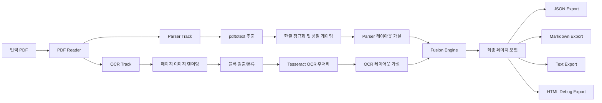

# DocStruct (한국어 문서)

DocStruct는 PDF 문서 구조를 복원하는 도구입니다. 아래 3개 트랙을 결합합니다.

- PDF 내부 정보를 이용한 Parser 추출
- 렌더링 이미지 기반 OCR 추출
- 두 결과를 정렬/비교해 최종 결과를 만드는 Fusion

혼합 문서(본문, 표, 그림, 수식)와 다국어 OCR 워크플로를 대상으로 합니다.

## 주요 기능

- 이중 트랙 분석: `Parser Track` + `OCR Track`
- 블록 분류: text, table, figure, math
- provenance/confidence 포함 융합 결과 (`parser`, `ocr`, `fused`)
- 한국어 지원:
  - 한글 자모 정규화/조합
  - Parser 품질 저하 시 OCR 교차검증 경로 사용
- 출력 포맷:
  - `document.json`
  - `document.md`
  - `document.txt`
  - 페이지별 markdown/text
  - HTML 디버그 뷰어

## 파이프라인



## 설치

### 요구사항

- Rust toolchain
- Python 3.12+
- `poppler-utils` (`pdftotext`, `pdftoppm`, `pdfinfo`)
- `tesseract` (필요한 언어 데이터 포함)

### 방법 1: Nix Flakes (권장)

```bash
cd /path/to/DocStruct
nix develop
cargo build
```

### 방법 2: Legacy nix-shell

```bash
cd /path/to/DocStruct
nix-shell
cargo build
```

### 방법 3: direnv

`.envrc`에 `use flake`가 포함되어 있습니다.

```bash
cd /path/to/DocStruct
direnv allow
cargo build
```

### 선택: 수식 LaTeX OCR (pix2tex)

```bash
pip install --user 'pix2tex[gui]>=0.1.2'
```

## 사용법

### 단일 PDF 변환

```bash
./target/debug/docstruct convert input.pdf -o output_dir --debug
```

### 배치 변환

```bash
./target/debug/docstruct batch file1.pdf file2.pdf -o output_dir --debug
```

### PDF 정보 출력

```bash
./target/debug/docstruct info input.pdf
```

### 주요 옵션

- `--dpi <int>`: OCR 렌더링 DPI (기본값: 200)
- `--debug`: 디버그 산출물(렌더 이미지 + HTML 오버레이) 저장
- `--quiet`: 콘솔 로그 축소

## 실행 예시 (PDF -> TXT)

```bash
./target/debug/docstruct convert tests/fixtures/test_document.pdf -o output_en --debug
```

예시 출력(`output_en/document.txt` 일부):

```text
=== Page 1 ===

OCR Stress Test Document
Mixed content for PDF -> Image -> Text validation
Abstract
This document intentionally mixes plain text, mathematical notation,
tables, lists, vector drawings, and hyperlinks.
...
```

## 출력 구조

```text
output_dir/
├── document.json
├── document.md
├── document.txt
├── page_001.md
├── page_001.txt
├── figures/
│   └── page_NNN_TYPE__NN.png
└── debug/
    ├── page_001.html
    └── page_001-1.png
```

## 개발 메모

```bash
cargo build
cargo test
cargo test parser::hangul
```

한국어 관련해서는 Parser 정규화/품질 게이팅 + Fusion/Export 필터로 자모 분해/중복 노이즈를 줄이는 로직이 포함되어 있습니다.

## 라이선스

MIT
