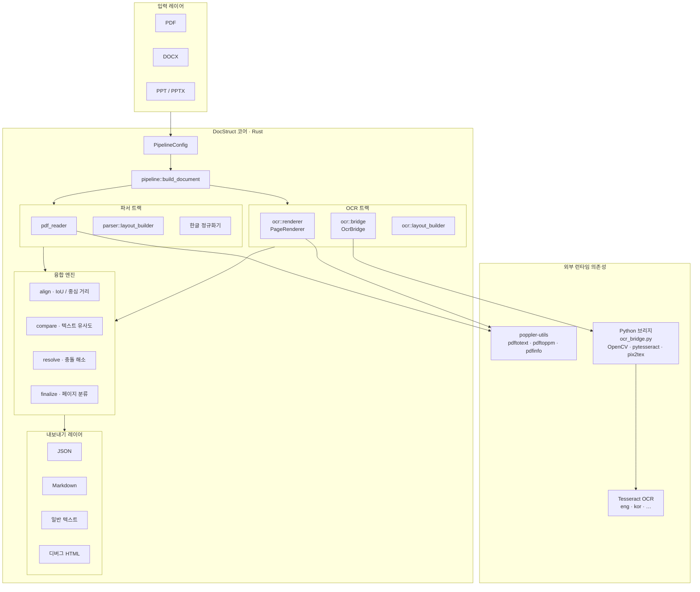
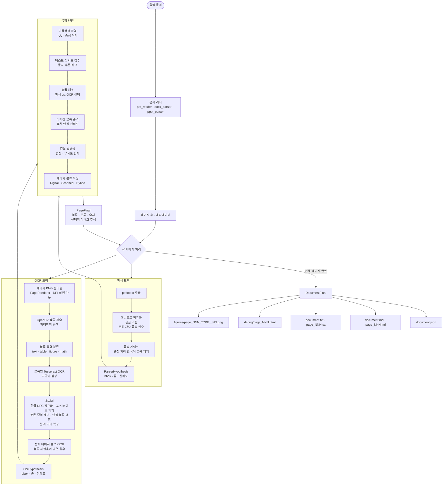
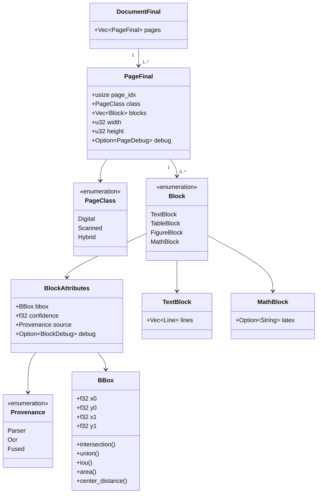
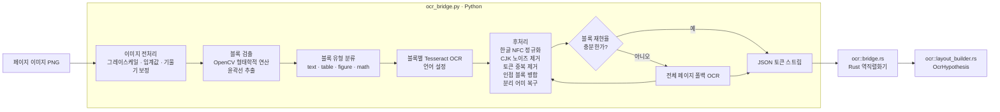
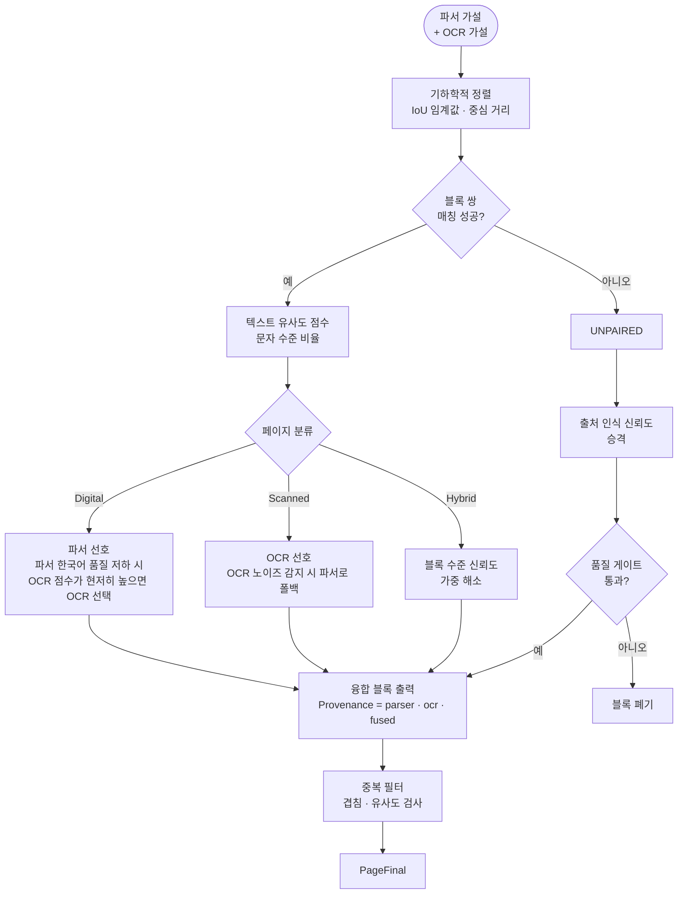
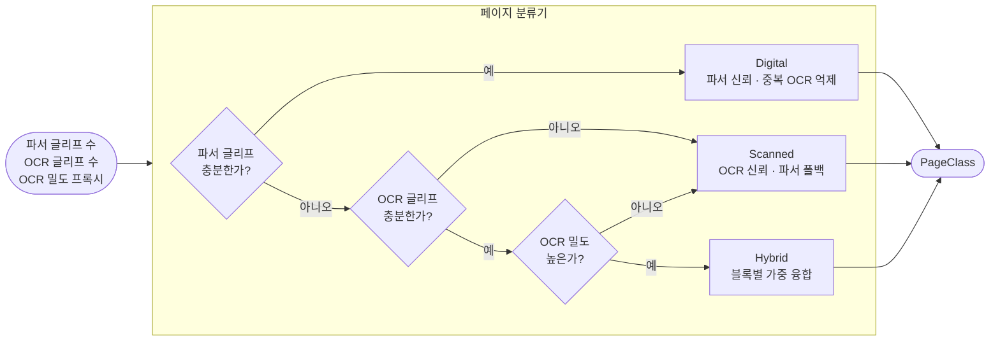

<p align="left">
  
</p>

# DocStruct

[](https://github.com/zeetee1235/DocStruct/actions/workflows/ci.yml)
[](https://github.com/zeetee1235/DocStruct/actions/workflows/docker-image.yml)
[](https://github.com/zeetee1235/DocStruct/commits/main)
[](../LICENSE)

> **DocStruct**는 PDF 네이티브 파싱과 광학 문자 인식(OCR)을 이중 트랙 융합(fusion) 파이프라인으로 결합하여 문서 구조를 복원하는 시스템입니다. PDF, DOCX, PPT, PPTX 형식의 이기종 문서로부터 출처(provenance)가 주석된 구조화 결과물을 생성합니다.

영문 문서: [../README.md](../README.md)

---

## 목차

1. [개요](#개요)
2. [시스템 아키텍처](#시스템-아키텍처)
3. [처리 파이프라인](#처리-파이프라인)
4. [모듈 설명](#모듈-설명)
   - [핵심 데이터 모델](#41-핵심-데이터-모델)
   - [파서 트랙](#42-파서-트랙)
   - [OCR 트랙](#43-ocr-트랙)
   - [융합 엔진](#44-융합-엔진)
   - [내보내기 레이어](#45-내보내기-레이어)
5. [페이지 분류](#페이지-분류)
6. [설치 요구사항](#설치-요구사항)
7. [사용법](#사용법)
   - [그래픽 사용자 인터페이스](#71-그래픽-사용자-인터페이스)
   - [명령행 인터페이스](#72-명령행-인터페이스)
8. [출력 명세](#출력-명세)
9. [설정 참조](#설정-참조)
10. [개발 및 테스트](#개발-및-테스트)
11. [알려진 한계](#알려진-한계)
12. [배포 정책](#배포-정책)
13. [기여 방법](#기여-방법)

---

## 개요

문서 디지털화 워크플로우에서는 근본적인 이중 문제가 존재합니다. PDF 네이티브 텍스트 추출은 프로그래밍으로 생성된 파일에서는 레이아웃 충실도를 높게 유지하지만, 스캔 또는 이미지 렌더링 콘텐츠에서는 실패합니다. 반면 OCR은 넓은 커버리지를 제공하지만 오류율과 환각(hallucination) 위험이 높습니다.

DocStruct는 이 문제를 **이중 트랙 증거 융합 아키텍처**로 해결합니다. 파서 트랙과 OCR 트랙이 페이지 단위로 독립적으로 동작하고, 전용 융합 엔진이 기하학적 정렬, 텍스트 유사도 점수, 출처 인식 신뢰도 휴리스틱을 통해 충돌을 해소합니다.

시스템은 Rust로 구현되며 Python OCR 브리지를 통해 동작하고, 한국어 특화 정규화(한글 조합, 분해된 자모 품질 점수 산정)를 지원합니다. 출력 결과는 JSON, Markdown, 일반 텍스트, 주석된 디버그 HTML 형식으로 제공됩니다. 각 출력 블록에는 출처 레이블(`parser`, `ocr`, `fused`)이 부여되어 하위 감사 추적이 가능합니다.

---

## 시스템 아키텍처

**그림 1**은 DocStruct의 고수준 컴포넌트 구조와 외부 의존성을 보여줍니다.


```mermaid
graph TB
    subgraph Input["입력 레이어"]
        I1[PDF]
        I2[DOCX]
        I3[PPT / PPTX]
    end

    subgraph Core["DocStruct 코어  ·  Rust"]
        direction TB
        CFG[PipelineConfig]
        PL[pipeline::build_document]

        subgraph Parser["파서 트랙"]
            PR[pdf_reader]
            PL2[parser::layout_builder]
            HG[한글 정규화기]
        end

        subgraph OCR["OCR 트랙"]
            RND[ocr::renderer\nPageRenderer]
            BRG[ocr::bridge\nOcrBridge]
            OLB[ocr::layout_builder]
        end

        subgraph Fusion["융합 엔진"]
            ALN[align · IoU / 중심 거리]
            CMP[compare · 텍스트 유사도]
            RSV[resolve · 충돌 해소]
            FNL[finalize · 페이지 분류]
        end

        subgraph Export["내보내기 레이어"]
            EJ[JSON]
            EM[Markdown]
            ET[일반 텍스트]
            EH[디버그 HTML]
        end
    end

    subgraph Ext["외부 런타임 의존성"]
        PP[poppler-utils\npdftotext · pdftoppm · pdfinfo]
        TS[Tesseract OCR\neng · kor · …]
        PY[Python 브리지\nocr_bridge.py\nOpenCV · pytesseract · pix2tex]
    end

    Input --> CFG
    CFG --> PL
    PL --> Parser
    PL --> OCR
    Parser --> Fusion
    OCR --> Fusion
    Fusion --> Export

    PR --> PP
    RND --> PP
    BRG --> PY
    PY --> TS
```

*그림 1 — DocStruct 컴포넌트 아키텍처. 화살표는 데이터 흐름을 나타내고, 경계선은 논리적 서브시스템을 구분합니다.*

---

## 처리 파이프라인

**그림 2**는 원시 입력에서 구조화된 융합 출력까지의 페이지별 처리 순서를 상세히 보여줍니다.


```mermaid
flowchart TD
    A([입력 문서]) --> B[문서 리더\npdf_reader · docx_parser · pptx_parser]
    B --> META[페이지 수 · 메타데이터]
    META --> LOOP{각 페이지 처리}

    LOOP --> PT[파서 트랙]
    LOOP --> OT[OCR 트랙]

    subgraph PT [" 파서 트랙 "]
        direction TB
        P1[pdftotext 추출]
        P2[유니코드 정규화\n한글 조합\n분해 자모 품질 점수]
        P3[품질 게이트\n품질 저하 한국어 블록 제거]
        P4[ParserHypothesis\nbbox · 줄 · 신뢰도]
        P1 --> P2 --> P3 --> P4
    end

    subgraph OT [" OCR 트랙 "]
        direction TB
        O1[페이지 PNG 렌더링\nPageRenderer · DPI 설정 가능]
        O2[OpenCV 블록 검출\n형태학적 연산]
        O3[블록 유형 분류\ntext · table · figure · math]
        O4[블록별 Tesseract OCR\n다국어 설정]
        O5[후처리\n한글 NFC 정규화 · CJK 노이즈 제거\n토큰 중복 제거 · 인접 블록 병합\n분리 어미 복구]
        O6[전체 페이지 폴백 OCR\n블록 재현율이 낮은 경우]
        O7[OcrHypothesis\nbbox · 줄 · 신뢰도]
        O1 --> O2 --> O3 --> O4 --> O5 --> O6 --> O7
    end

    P4 --> FUS[융합 엔진]
    O7 --> FUS

    subgraph FUS [" 융합 엔진 "]
        direction TB
        F1[기하학적 정렬\nIoU · 중심 거리]
        F2[텍스트 유사도 점수\n문자 수준 비교]
        F3[충돌 해소\n파서 vs. OCR 선택]
        F4[미매칭 블록 승격\n출처 인식 신뢰도]
        F5[중복 필터링\n겹침 · 유사도 검사]
        F6[페이지 분류 확정\nDigital · Scanned · Hybrid]
        F1 --> F2 --> F3 --> F4 --> F5 --> F6
    end

    FUS --> PAGE[PageFinal\n블록 · 분류 · 출처\n선택적 디버그 주석]
    PAGE --> LOOP

    LOOP -->|전체 페이지 완료| DOC[DocumentFinal]

    DOC --> EJ[document.json]
    DOC --> EM[document.md · page_NNN.md]
    DOC --> ET[document.txt · page_NNN.txt]
    DOC --> EH[debug/page_NNN.html]
    DOC --> EF[figures/page_NNN_TYPE__NN.png]
```

*그림 2 — 페이지별 처리 파이프라인. 두 트랙이 독립적으로 실행되며, 융합 엔진이 충돌을 해소하고 최종 페이지 모델을 구성합니다.*

---

## 모듈 설명

### 4.1 핵심 데이터 모델

`src/core` 모듈은 파이프라인 전 단계에서 공유하는 표준 데이터 타입을 정의합니다.


```mermaid
classDiagram
    class DocumentFinal {
        +Vec~PageFinal~ pages
    }
    class PageFinal {
        +usize page_idx
        +PageClass class
        +Vec~Block~ blocks
        +u32 width
        +u32 height
        +Option~PageDebug~ debug
    }
    class PageClass {
        <<enumeration>>
        Digital
        Scanned
        Hybrid
    }
    class Block {
        <<enumeration>>
        TextBlock
        TableBlock
        FigureBlock
        MathBlock
    }
    class BlockAttributes {
        +BBox bbox
        +f32 confidence
        +Provenance source
        +Option~BlockDebug~ debug
    }
    class TextBlock {
        +Vec~Line~ lines
    }
    class MathBlock {
        +Option~String~ latex
    }
    class Provenance {
        <<enumeration>>
        Parser
        Ocr
        Fused
    }
    class BBox {
        +f32 x0
        +f32 y0
        +f32 x1
        +f32 y1
        +intersection()
        +union()
        +iou()
        +area()
        +center_distance()
    }

    DocumentFinal "1" --> "1..*" PageFinal
    PageFinal --> PageClass
    PageFinal "1" --> "0..*" Block
    Block --> BlockAttributes
    Block --> TextBlock
    Block --> MathBlock
    BlockAttributes --> Provenance
    BlockAttributes --> BBox
```

*그림 3 — 핵심 도메인 모델. 모든 `Block`은 `Provenance` 레이블과 `BBox`를 가져 파이프라인 전체에서 기하학적 연산이 가능합니다.*

**핵심 설계 결정:**

- 모든 타입은 `serde` 직렬화 가능으로, 별도의 변환 레이어 없이 JSON 내보내기가 이루어집니다.
- 모든 블록에 `Provenance`가 보존되어 융합 결정의 완전한 감사 추적이 지원됩니다.
- `PageClass`(융합 엔진에서 결정)는 출처 선호도를 제어합니다: `Digital` 페이지는 파서 트랙, `Scanned` 페이지는 주로 OCR, `Hybrid` 페이지는 가중 해소를 적용합니다.

---

### 4.2 파서 트랙

| 컴포넌트 | 담당 역할 |
|---|---|
| `pdf_reader.rs` | PDF 열기, `pdfinfo`를 통한 페이지 수 및 메타데이터 읽기 |
| `text_extractor` | `pdftotext` 호출 및 원시 텍스트 스트림 정규화 |
| `hangul.rs` | 한글 음절 분해/재조합, 자모 품질 저하 점수 산정 |
| `layout_builder.rs` | 바운딩 박스 추정이 포함된 `ParserHypothesis` 구성 |
| `docx_parser.rs` | ZIP/XML 순회를 통한 DOCX 구조화 콘텐츠 추출 |
| `pptx_parser.rs` | PPTX에서 슬라이드 텍스트 및 도형 기하 추출 |

**실패 프로파일:** 파서 트랙은 렌더링 전용 텍스트나 그림을 누락할 수 있으며, PDF 내부 인코딩에 따라 분해되거나 노이즈가 포함된 유니코드를 출력할 수 있습니다. 품질 게이트가 심각하게 품질 저하된 한국어 출력을 융합 단계 이전에 걸러냅니다.

---

### 4.3 OCR 트랙

OCR 트랙은 Rust 오케스트레이터와 Python 브리지 프로세스로 구성됩니다.

**그림 4**는 Python 브리지의 내부 처리 단계를 보여줍니다.


```mermaid
flowchart LR
    IMG[페이지 이미지 PNG] --> PRE

    subgraph PY ["ocr_bridge.py  ·  Python"]
        PRE[이미지 전처리\n그레이스케일 · 임계값 · 기울기 보정]
        BLK[블록 검출\nOpenCV 형태학적 연산\n윤곽선 추출]
        CLS[블록 유형 분류\ntext · table · figure · math]
        TSR[블록별 Tesseract OCR\n언어 설정]
        PST[후처리\n한글 NFC 정규화\nCJK 노이즈 제거\n토큰 중복 제거\n인접 블록 병합\n분리 어미 복구]
        FBK{블록 재현율\n충분한가?}
        FPG[전체 페이지 폴백 OCR]

        PRE --> BLK --> CLS --> TSR --> PST --> FBK
        FBK -- 아니오 --> FPG --> PST
        FBK -- 예 --> OUT
        FPG --> OUT
    end

    OUT[JSON 토큰 스트림] --> RB[ocr::bridge.rs\nRust 역직렬화기]
    RB --> OLB[ocr::layout_builder.rs\nOcrHypothesis]
```

*그림 4 — Python OCR 브리지의 내부 단계. 블록 재현율 검사를 통해 세그멘테이션 커버리지가 불충분한 경우 전체 페이지 폴백 OCR이 실행됩니다.*

**수식 OCR(선택):** `pix2tex`가 설치된 경우 `MathBlock` 영역은 전용 LaTeX 예측 모델로 라우팅됩니다.

---

### 4.4 융합 엔진

융합 엔진은 두 독립 가설 간의 충돌을 해소하고 최종 페이지 모델을 결정합니다.

**그림 5**는 매칭된 블록 쌍에 대한 해소 논리를 보여줍니다.


```mermaid
flowchart TD
    START([파서 가설\n+ OCR 가설]) --> ALIGN

    ALIGN[기하학적 정렬\nIoU 임계값 · 중심 거리]

    ALIGN --> MATCHED{블록 쌍\n매칭 성공?}

    MATCHED -- 예 --> SIM[텍스트 유사도 점수\n문자 수준 비율]
    MATCHED -- 아니오 --> UNPAIRED

    SIM --> PC{페이지 분류}

    PC -- Digital --> PRFTRUST[파서 선호\n파서 한국어 품질 저하 시\nOCR 점수가 현저히 높으면 OCR 선택]
    PC -- Scanned --> OCRTRUST[OCR 선호\nOCR 노이즈 감지 시 파서로 폴백]
    PC -- Hybrid --> WRES[블록 수준 신뢰도\n가중 해소]

    PRFTRUST --> EMIT[융합 블록 출력\nProvenance = parser · ocr · fused]
    OCRTRUST --> EMIT
    WRES --> EMIT

    UNPAIRED --> CONF[출처 인식 신뢰도\n승격]
    CONF --> QGATE{품질 게이트\n통과?}
    QGATE -- 예 --> EMIT
    QGATE -- 아니오 --> DROP[블록 폐기]

    EMIT --> REDUND[중복 필터\n겹침 · 유사도 검사]
    REDUND --> FINAL[PageFinal]
```

*그림 5 — 융합 해소 논리. 모든 매칭 블록 쌍은 페이지 분류 인식 출처 선택을 거치며, 미매칭 블록은 출처 인식 신뢰도로 승격 후 품질 게이트에서 필터링됩니다.*

**핵심 휴리스틱:**

- **디지털 텍스트에 대한 파서 신뢰:** 깨끗한 디지털 페이지는 원본 유니코드 충실도를 보존하는 파서 트랙을 선호합니다.
- **커버리지 공백에 대한 OCR:** 파서 가설에 없는 영역(예: 이미지 내 렌더링 텍스트)은 OCR 트랙에서 가져옵니다.
- **한국어 정밀도 제어:** 파서 한국어 가설이 신뢰 가능한 경우 엄격한 OCR 한국어 억제를 적용하여 재현율보다 문자 수준 정밀도를 우선합니다.
- **중복 제거:** 겹침 및 유사도 기준으로 파서 콘텐츠를 중복하는 OCR 스니펫을 필터링하여 최종 내보내기에서 반복 콘텐츠를 방지합니다.

---

### 4.5 내보내기 레이어

| 내보내기 모듈 | 출력 파일 | 설명 |
|---|---|---|
| `json_export.rs` | `document.json` | 출처 및 신뢰도가 포함된 완전한 구조화 문서 |
| `markdown_export.rs` | `document.md`, `page_NNN.md` | 제목 계층 구조를 보존하는 사람이 읽을 수 있는 Markdown |
| `text_export.rs` | `document.txt`, `page_NNN.txt` | 하위 NLP 파이프라인을 위한 일반 텍스트 연결 |
| `html_debug_export.rs` | `debug/page_NNN.html` | 블록별 메타데이터 오버레이: 유형, 출처, 신뢰도, 유사도 |

---

## 페이지 분류

페이지 분류는 각 페이지에 적용되는 융합 전략을 결정합니다.


```mermaid
flowchart LR
    IN([파서 글리프 수\nOCR 글리프 수\nOCR 밀도 프록시]) --> CLS

    subgraph CLS [페이지 분류기]
        direction TB
        C1{파서 글리프\n충분한가?}
        C2{OCR 글리프\n충분한가?}
        C3{OCR 밀도\n높은가?}

        C1 -- 예 --> DIG[Digital\n파서 신뢰 · 중복 OCR 억제]
        C1 -- 아니오 --> C2
        C2 -- 아니오 --> SCN[Scanned\nOCR 신뢰 · 파서 폴백]
        C2 -- 예 --> C3
        C3 -- 예 --> HYB[Hybrid\n블록별 가중 융합]
        C3 -- 아니오 --> SCN
    end

    DIG --> OUT([PageClass])
    SCN --> OUT
    HYB --> OUT
```

*그림 6 — 페이지 분류 결정 논리. 결과 `PageClass`(Digital / Scanned / Hybrid)가 융합 엔진의 공격성과 출처 선호도를 결정합니다.*

---

## 설치 요구사항

### 런타임 요구사항

| 의존성 | 용도 | 필수 여부 |
|---|---|---|
| Rust toolchain (`cargo`) | DocStruct 빌드 | 필수 |
| Python 3.8+ | OCR 브리지 런타임 | 필수 |
| `tesseract` + 언어 팩 (`eng`, `kor`, …) | OCR 엔진 | 필수 |
| `poppler-utils` (`pdfinfo`, `pdftotext`, `pdftoppm`) | PDF 파싱 및 렌더링 | 필수 |
| WebKitGTK | GUI 런타임 (Linux) | GUI 전용 |
| Wayland 개발/런타임 패키지 | GUI 런타임 (Linux/Wayland) | GUI 전용 |

### Python 의존성

```bash
pip install -r requirements.txt
```

### 선택 사항: 수식 OCR

```bash
pip install --user 'pix2tex[gui]>=0.1.2'
```

설치 시 `MathBlock` 영역이 표준 Tesseract OCR에 더해 `pix2tex` LaTeX 예측 모델로 처리됩니다.

### 사전 빌드 바이너리

Linux, Windows, macOS용 컴파일된 바이너리는 [Releases](https://github.com/zeetee1235/DocStruct/releases) 페이지에서 제공됩니다.

---

## 사용법

### 7.1 그래픽 사용자 인터페이스


*그림 7 — DocStruct 데스크톱 GUI (Tauri). 파일 선택, DPI 설정, 인라인 결과 표시가 단일 워크플로우로 제공됩니다.*

GUI 실행:

```bash
./run-gui
```

`run-gui` 스크립트가 자동으로 수행하는 작업:

1. Python 가상 환경(`.venv`) 생성 또는 재사용
2. `requirements.txt`에서 의존성 설치
3. Tauri 데스크톱 애플리케이션 실행

**사용 순서:**

1. 하나 이상의 입력 파일 선택 (PDF, DOCX, PPT, PPTX).
2. 출력 디렉터리 선택 (선택 사항).
3. DPI 설정 조정 (기본값: `200`; 높을수록 OCR 정확도 향상, 처리 시간 증가).
4. **Convert** 클릭.

출력 디렉터리를 지정하지 않으면 추출된 텍스트가 애플리케이션 내부에 인라인으로 표시됩니다. **Copy Text** 버튼으로 시스템 클립보드에 복사할 수 있습니다.

---

### 7.2 명령행 인터페이스

#### 빌드

```bash
cargo build --release
```

#### 단일 파일 변환

```bash
./target/release/docstruct convert input.pdf -o output_dir --debug
```

#### 다중 파일 일괄 변환

```bash
./target/release/docstruct batch file1.pdf file2.pdf -o output_dir --debug
```

#### 문서 메타데이터 확인

```bash
./target/release/docstruct info input.pdf
```

#### CLI 옵션

| 플래그 | 타입 | 기본값 | 설명 |
|---|---|---|---|
| `--dpi <int>` | `u32` | `200` | OCR용 페이지 렌더링 DPI |
| `--debug` | 플래그 | 꺼짐 | 디버그 산출물 생성 (HTML 오버레이, 중간 PNG) |
| `--quiet` | 플래그 | 꺼짐 | 상세 콘솔 출력 억제 |

---

## 출력 명세

```text
output_dir/
├── document.json          # 전체 구조화 문서 (전체 페이지, 전체 블록, 출처 포함)
├── document.md            # 병합된 Markdown 내보내기
├── document.txt           # 병합된 일반 텍스트 내보내기
├── page_001.md            # 페이지별 Markdown
├── page_001.txt           # 페이지별 일반 텍스트
├── figures/
│   └── page_NNN_TYPE__NN.png   # 추출된 그림/표 영역
└── debug/                 # --debug 플래그 사용 시 생성
    ├── page_001.html      # 주석된 블록 오버레이 (유형 · 출처 · 신뢰도)
    └── page_001-1.png     # OCR에 사용된 렌더링된 페이지 이미지
```

**JSON 스키마 예시:**

```json
{
  "pages": [
    {
      "page_idx": 0,
      "class": "digital",
      "blocks": [
        {
          "type": "TextBlock",
          "bbox": { "x0": 72.0, "y0": 90.0, "x1": 540.0, "y1": 110.0 },
          "lines": [ { "text": "서론", "confidence": 0.97 } ],
          "confidence": 0.97,
          "source": "parser"
        }
      ]
    }
  ]
}
```

---

## 설정 참조

`PipelineConfig` (Rust 구조체, `src/pipeline.rs`):

| 필드 | 타입 | 설명 |
|---|---|---|
| `input` | `PathBuf` | 입력 문서 경로 |
| `output` | `PathBuf` | 출력 디렉터리 경로 |
| `dpi` | `u32` | `pdftoppm` 및 OCR 브리지에 전달되는 렌더링 DPI |

OCR 브리지 경로에 대한 환경 변수 오버라이드는 런타임에 적용됩니다 (`src/ocr/bridge.rs` 참조).

---

## 개발 및 테스트

```bash
# 빌드 (디버그 프로파일)
cargo build

# 전체 테스트 실행
cargo test

# 특정 테스트 모듈 실행
cargo test parser::hangul

# 샘플 픽스처에 대한 스모크 테스트
./scripts/smoke.sh

# 출력 구조 검증
./scripts/verify.sh

# 참조 픽스처 대비 정확도 평가
python scripts/eval_accuracy.py
```

**테스트 커버리지 영역:**

| 영역 | 상태 |
|---|---|
| 기하 기초 연산 (`BBox` 연산) | 커버됨 |
| 텍스트 유사도 점수 | 커버됨 |
| 한글 정규화 동작 | 커버됨 |
| 융합 필터링/선택 케이스 | 커버됨 |
| 파서 + OCR 통합 스모크 테스트 | 커버됨 |
| 언어별 정밀도/재현율 회귀 | 권장 추가 |
| 페이지 분류 회귀 (`Digital/Scanned/Hybrid`) | 권장 추가 |
| OCR 브리지 후처리 스냅샷 테스트 | 권장 추가 |

아키텍처 세부 사항은 [ARCHITECTURE.md](./ARCHITECTURE.md)를 참조하세요.

---

## 알려진 한계

| 영역 | 한계 사항 |
|---|---|
| 수식 콘텐츠 | `pix2tex` 사용 시에도 수식 밀도가 높은 영역에서 OCR 기호 환각이 발생할 수 있음 |
| 커버리지 측정 | 블록 커버리지는 휴리스틱으로 추정되며 시맨틱 세그멘테이션이 적용되지 않음 |
| 파서 레이아웃 | 복잡한 다단 또는 커스텀 인코딩을 가진 일부 PDF에서 파서 트랙의 레이아웃 충실도가 저하될 수 있음 |
| OCR 엣지 케이스 | 특정 스캔 페이지에서 낮은 신뢰도의 짧은 단편이 품질 게이트를 통과할 수 있음 |
| 한국어 OCR 재현율 | 엄격한 한국어 억제가 정밀도를 향상시키지만 OCR 전용 영역에서 재현율을 감소시킬 수 있음 |

---

## 배포 정책

`v*` 형식의 Git 태그 푸시 시 자동화된 GitHub Actions 워크플로우가 실행됩니다.

| 플랫폼 | 산출물 | 워크플로우 |
|---|---|---|
| Linux | CLI 바이너리, `.deb`, `.rpm` | [`release.yml`](../.github/workflows/release.yml) |
| Windows / macOS | Tauri GUI 설치 파일 | [`gui-release.yml`](../.github/workflows/gui-release.yml) |
| Linux | GUI `.deb`, `.rpm` | [`gui-release.yml`](../.github/workflows/gui-release.yml) |
| 전체 | Docker 이미지 | [`docker-image.yml`](../.github/workflows/docker-image.yml) |

#### GUI 설치 파일 로컬 빌드

```bash
./scripts/build-gui-app.sh
# 출력: gui/src-tauri/target/release/bundle/
```

Linux에서는 기본적으로 `.deb` 및 `.rpm` 패키지가 생성됩니다.

---

## 기여 방법

기여를 환영합니다. 코딩 표준, 브랜치 전략 및 풀 리퀘스트 가이드라인은 [CONTRIBUTING.md](../CONTRIBUTING.md)를 참조하세요.
