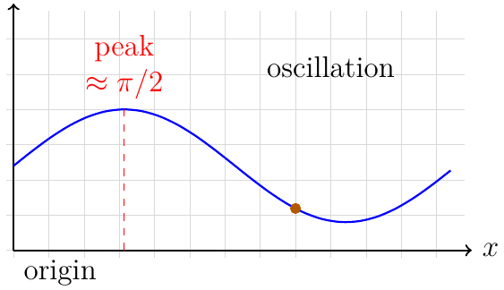
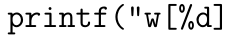

# Document

---

## Page 1

OCR Stress Test Document
Mixed content for PDF → Image → Text validation
pdfocr Project
January 8, 2026
Abstract
This document intentionally mixes plain text, mathematical notation, tables, lists,
vector drawings, and hyperlinks. It is meant to probe how well the OCR pipeline
handles varied layouts, line breaks, and semantic structure.

1

Overview

The following sections combine narrative text with display math and inline symbols such as
⃗ = ρ/ε0 , and probability notation P(X ≤ x). Paragraphs use hyphenation
E = mc2 , ∇ · E
and line wraps to stress layout-aware OCR. Repeated words with subtle differences (e.g.,
kernel vs. kernels) are present to spot hallucinations.

2

Display Mathematics

We include a few multi-line expressions to check alignment:
f (x) =

Z ∞

2

−∞

e−t dt =

√
π,

(1)

Ax = λx,

(2)

π
1
= .
2
6
n=1 n

(3)

∞
X

2

A short derivation with text interleaved:
d  t sin t 
e
= et sin t · (sin t + t cos t).
dt

3

(4)

Table and Lists

The table mixes numbers, symbols, and words to see how column boundaries are recovered.
1

=

Stress

Document

Mixed

for

PDF

validation

Image

Text

content

pdfocr

Project

January

Abstract

This document intentionally mixes plain text, mathematical notation, tables, lists,

drawings,

hyperlinks.

probe

how well

pipeline

vector

meant

handles varied layouts, line breaks, and semantic structure.

Overview

The following sections combine narrative text with display math and inline symbols such as

V'E:P/fo-,

and probability notation P(X

Paragraphs use hyphenation

OCR.

differences

and

line wraps

layout-aware

Repeated

words

with subtle

stress

kernels)

kernel vs.

are present to spot hallucinations.

Display

Mathematics

We include a few multi-line expressions to check alignment:

e P dt =/,

Ax = Xx

A short derivation with text interleaved:

=M. (sint + t cost).

Table

and

The table mixes numbers, symbols, and words to see how column boundaries are recovered.

---

## Page 2

PDF OCR Stress Test

2

Feature

Value

Uncertainty

Note

Temperature (◦ C)
Pressure (kPa)
Accuracy (%)
Latency (ms)

21.4
101.2
98.7
42

±0.3
±0.5
±0.1
±5

baseline
nominal
high-confidence
measured on edge

Table 1: Structured data with mixed units.
Nested lists follow:
• Top-level bullet with a hyperlink: https://example.com/data.
• Another bullet with emphasized text and a footnote.1
• Enumerated sub-tasks:
1. Capture inline math such as α, β, γ.
2. Handle words split across lines (hyphen- ation).
3. Keep indentation hints intact.

4

Vector Figure

The figure below is drawn with TikZ to avoid external images while still giving curves, labels,
and color.
y
peak
≈ π/2

oscillation

origin

x

Figure 1: Sine-like curve with annotations and grid.

1

Footnotes are included to see if ordering is preserved.

PDF OCR Stress Test

Feature

Value

Uncertainty

Note

Temperature (°C) 214 +0.3 baseline
Pressure (kPa) 101.2 +0.5 nominal
Accuracy (%) 98.7 +0.1 high-confidence

Latency (ms) 42 +5 measured on edge

baseline

nominal

high-confidence

+0.1

measured on edge

Structured data with mixed

Table 1:

units.

Nested lists follow:

Top-level bullet with a hyperlink: https://example.com/data

Another bullet with emphasized text and a footnoteEl

Enumerated sub-tasks:

Capture inline math such as o, 3, 7.

Handle words split across lines (hyphen- ation).

Keep indentation hints intact.

Vector

Figure

The figure below is drawn with TikZ to avoid external images while still giving curves, labels,

and color.

**Figure 35:**

Sine-like curve with annotations and grid.

Figure 1:

Footnotes are included to see if ordering is preserved.

---

## Page 3

PDF OCR Stress Test

5

3

Paragraph Stress Test

Continuous prose with mixed punctuation: “Edge-aware OCR systems must balance recall
and precision; however, noise—especially from compressed scans—can create artifacts.” The
quick brown fox jumps over the lazy dog. A second paragraph repeats with minor edits to
detect hallucination: the quick brown fox jumps over the lazy dog, but this time the fox
pauses at line breaks to test robustness.

6

Code Fragment

Verbatim text can challenge OCR because of monospaced glyphs:
for (int i = 0; i < 5; ++i) {
double w = exp(-0.5 * pow(i - 2.0, 2));
printf("w[%d] = %.3f\n", i, w);
}

7

Conclusion

This concludes the synthetic PDF. Inspect the extracted text for dropped symbols, merged
lines, and mis-ordered sections. Compare the OCR output with the known ground truth
here to quantify accuracy.

PDF OCR Stress Test

Stress

Paragraph

Continuous prose with mixed punctuation:

“Edge-aware OCR systems must balance recall

and precision; however, noise—especially from compressed scans—can create artifacts.”

quick brown fox jumps over the lazy dog.

A second paragraph repeats with minor edits to

fox jumps

detect

hallucination:

quick

brown

over the

lazy

dog,

this

time

pauses at line breaks to test robustness.

Fragment

Verbatim text can challenge OCR because of monospaced glyphs:

(int

++i)

exp(-0.5

pow (i

2));

double

2.0,

**Math Equation 34:**

%.3f\n",

Conclusion

text for dropped symbols, merged

This concludes the synthetic PDF. Inspect the extracted

Compare the

OCR output

lines,

and

mis-ordered

with

known ground

truth

sections.

here to quantify accuracy.

